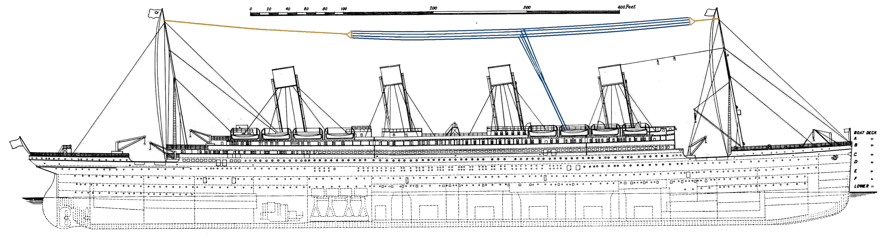

# Welcome to this Titanic Kaggle project!
Top 5% on Kaggle. Who will survive?

**Today we will learn from data!** 

Let's take a dive into the most popular Kaggle challenge: **the Titanic disaster**.\
The main goal is to predict survivals. To do that properly a structured appproach must be done. 

Three main parts will be taken.\
+ **Exploratory Data Analysis**\
*Goal : Get a deep understanding of the data. No data modify will be made and statistical test will of course be used when necessary.*
+ **Preprocessing**\
*Goal : Make some feature engineering to get bright new informations. I bet you could find some fresh ideas in this part, even if you're used to this challenge.*
+ **Machine Learning**\
*Goal : Implementing machine learning classifiers and analyse their performance.*

 
PS : Many home made tools are used in this Kernel, I will explain them with more clarity as possible. However, if it's unclear you can ask on the comment section below.

I'm super excited to share this work with you and I hope you will find it interresting. I wish you a good reading.
***

