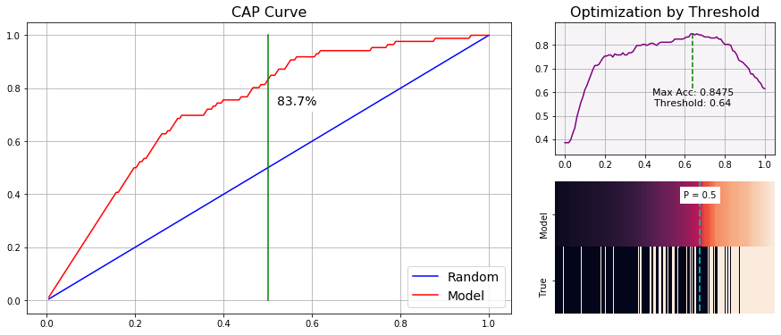
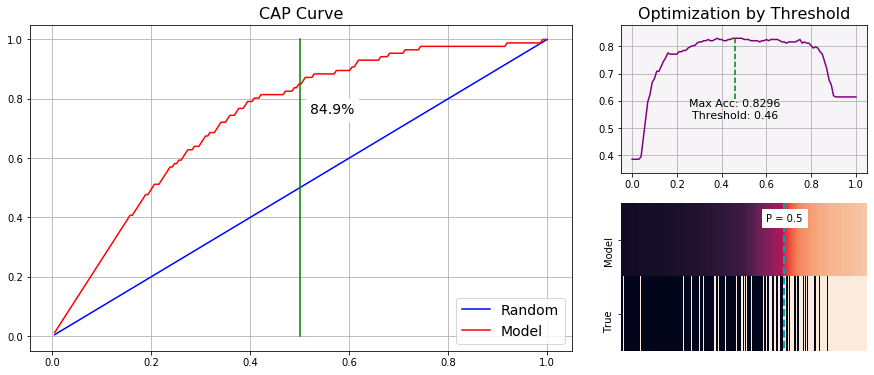

# Welcome to this Titanic Kaggle project!
Top 5% on Kaggle. Who will survive?


**Today we will learn from data!** 

Let's take a dive into the most popular Kaggle challenge: **the Titanic disaster**.\
A structured appproach must be done to predict survivals with advenced classification methods.

Three main parts will be taken.
+ **Exploratory Data Analysis**\
*Goal : Get a deep understanding of the data. No data will be modified and statistical test will be used when necessary.*
+ **Preprocessing**\
*Goal : Make some feature engineering to get bright new informations. Some fresh ideas will be found in this part, perhaps even if you're used to this challenge.*
+ **Machine Learning**\
*Goal : Implementing machine learning classifiers and analyse their performance.*

 
PS : Many home made tools are used in this Kernel, I will explain them with more clarity as possible. However, if it's unclear you can ask me and I will be pleased to answer you.

I'm super excited to share this work with you and I hope you will find it interresting. I wish you a good reading.

First thing first, necessary librairies and data are imported. A copy is immediately made to work on.


```python
import pandas as pd
import numpy as np
import matplotlib.pyplot as plt
import seaborn as sns
from scipy.stats import norm
pd.set_option('display.max_columns',None) #Put no limit in columns number to display 
import warnings
warnings.simplefilter('ignore')           #Ignore warning to don't be bothered.
```


```python
df_tr = pd.read_csv('train.csv')
df_te = pd.read_csv('test.csv')
df_train = df_tr.copy()
df_test = df_te.copy()
```

# 1 - Exploratory Data Analysis

## 1.1 - Shape Analysis

### 1.1.1 - Routine

I usually use this function as a small routine to apply on every datasets. It gives us some precious informations as the shape, head & tail, types of columns and a NaN mapping.


```python
def shape_routine(df,display_values=5,limit=10000,dimension = (12,7)):
    '''Make the shape routine
    df : dataframe to be explored
    display_values : int (number of displayed elements)
    limit : int (max elements to do the NaN map step via seaborn heatmap)
    dimension : tuple (NaN map dimension)
    '''
    
    # Step 1 = Print the general shape
    shape = df.shape
    s_shape = 'Shape '
    print(f'{s_shape :-<50} {shape}')
    
    # Step 2 = Print head / tail / dtypes / NaN
    dfn = pd.DataFrame(data= df.isna().sum(),columns=['NaN_Nb'])
    dfn['NaN_%']=round(df.isna().sum()/df.shape[0]*100,2)
    dfn['dtype']=df.dtypes
    
    # Step 3 = Map NaN
    if df.shape[0]*df.shape[1]<=limit:
        plt.figure(figsize=dimension)
        sns.heatmap(~df.isna(),cbar=False,vmin=0,vmax=1)
        plt.title('Map NaN :     Black >> NaN   |   White >> Not NaN',fontsize=17)      
    else:
        print('NaN not map due to limit')
        
    # Step 4 = Return the general infomation
    return pd.concat([dfn.T,df.head(display_values),df.tail(display_values)],axis='index')
```


```python
shape_routine(df_train,limit = 20000)
```

    Shape -------------------------------------------- (891, 12)
    


<div>
<style scoped>
    .dataframe tbody tr th:only-of-type {
        vertical-align: middle;
    }

    .dataframe tbody tr th {
        vertical-align: top;
    }

    .dataframe thead th {
        text-align: right;
    }
</style>
<table border="1" class="dataframe">
  <thead>
    <tr style="text-align: right;">
      <th></th>
      <th>PassengerId</th>
      <th>Survived</th>
      <th>Pclass</th>
      <th>Name</th>
      <th>Sex</th>
      <th>Age</th>
      <th>SibSp</th>
      <th>Parch</th>
      <th>Ticket</th>
      <th>Fare</th>
      <th>Cabin</th>
      <th>Embarked</th>
    </tr>
  </thead>
  <tbody>
    <tr>
      <th>NaN_Nb</th>
      <td>0</td>
      <td>0</td>
      <td>0</td>
      <td>0</td>
      <td>0</td>
      <td>177</td>
      <td>0</td>
      <td>0</td>
      <td>0</td>
      <td>0</td>
      <td>687</td>
      <td>2</td>
    </tr>
    <tr>
      <th>NaN_%</th>
      <td>0</td>
      <td>0</td>
      <td>0</td>
      <td>0</td>
      <td>0</td>
      <td>19.87</td>
      <td>0</td>
      <td>0</td>
      <td>0</td>
      <td>0</td>
      <td>77.1</td>
      <td>0.22</td>
    </tr>
    <tr>
      <th>dtype</th>
      <td>int64</td>
      <td>int64</td>
      <td>int64</td>
      <td>object</td>
      <td>object</td>
      <td>float64</td>
      <td>int64</td>
      <td>int64</td>
      <td>object</td>
      <td>float64</td>
      <td>object</td>
      <td>object</td>
    </tr>
    <tr>
      <th>0</th>
      <td>1</td>
      <td>0</td>
      <td>3</td>
      <td>Braund, Mr. Owen Harris</td>
      <td>male</td>
      <td>22</td>
      <td>1</td>
      <td>0</td>
      <td>A/5 21171</td>
      <td>7.25</td>
      <td>NaN</td>
      <td>S</td>
    </tr>
    <tr>
      <th>1</th>
      <td>2</td>
      <td>1</td>
      <td>1</td>
      <td>Cumings, Mrs. John Bradley (Florence Briggs Th...</td>
      <td>female</td>
      <td>38</td>
      <td>1</td>
      <td>0</td>
      <td>PC 17599</td>
      <td>71.2833</td>
      <td>C85</td>
      <td>C</td>
    </tr>
    <tr>
      <th>2</th>
      <td>3</td>
      <td>1</td>
      <td>3</td>
      <td>Heikkinen, Miss. Laina</td>
      <td>female</td>
      <td>26</td>
      <td>0</td>
      <td>0</td>
      <td>STON/O2. 3101282</td>
      <td>7.925</td>
      <td>NaN</td>
      <td>S</td>
    </tr>
    <tr>
      <th>3</th>
      <td>4</td>
      <td>1</td>
      <td>1</td>
      <td>Futrelle, Mrs. Jacques Heath (Lily May Peel)</td>
      <td>female</td>
      <td>35</td>
      <td>1</td>
      <td>0</td>
      <td>113803</td>
      <td>53.1</td>
      <td>C123</td>
      <td>S</td>
    </tr>
    <tr>
      <th>4</th>
      <td>5</td>
      <td>0</td>
      <td>3</td>
      <td>Allen, Mr. William Henry</td>
      <td>male</td>
      <td>35</td>
      <td>0</td>
      <td>0</td>
      <td>373450</td>
      <td>8.05</td>
      <td>NaN</td>
      <td>S</td>
    </tr>
    <tr>
      <th>886</th>
      <td>887</td>
      <td>0</td>
      <td>2</td>
      <td>Montvila, Rev. Juozas</td>
      <td>male</td>
      <td>27</td>
      <td>0</td>
      <td>0</td>
      <td>211536</td>
      <td>13</td>
      <td>NaN</td>
      <td>S</td>
    </tr>
    <tr>
      <th>887</th>
      <td>888</td>
      <td>1</td>
      <td>1</td>
      <td>Graham, Miss. Margaret Edith</td>
      <td>female</td>
      <td>19</td>
      <td>0</td>
      <td>0</td>
      <td>112053</td>
      <td>30</td>
      <td>B42</td>
      <td>S</td>
    </tr>
    <tr>
      <th>888</th>
      <td>889</td>
      <td>0</td>
      <td>3</td>
      <td>Johnston, Miss. Catherine Helen "Carrie"</td>
      <td>female</td>
      <td>NaN</td>
      <td>1</td>
      <td>2</td>
      <td>W./C. 6607</td>
      <td>23.45</td>
      <td>NaN</td>
      <td>S</td>
    </tr>
    <tr>
      <th>889</th>
      <td>890</td>
      <td>1</td>
      <td>1</td>
      <td>Behr, Mr. Karl Howell</td>
      <td>male</td>
      <td>26</td>
      <td>0</td>
      <td>0</td>
      <td>111369</td>
      <td>30</td>
      <td>C148</td>
      <td>C</td>
    </tr>
    <tr>
      <th>890</th>
      <td>891</td>
      <td>0</td>
      <td>3</td>
      <td>Dooley, Mr. Patrick</td>
      <td>male</td>
      <td>32</td>
      <td>0</td>
      <td>0</td>
      <td>370376</td>
      <td>7.75</td>
      <td>NaN</td>
      <td>Q</td>
    </tr>
  </tbody>
</table>
</div>


```python
shape_routine(df_test,limit=20000)
```

    Shape -------------------------------------------- (418, 11)
    


<div>
<style scoped>
    .dataframe tbody tr th:only-of-type {
        vertical-align: middle;
    }

    .dataframe tbody tr th {
        vertical-align: top;
    }

    .dataframe thead th {
        text-align: right;
    }
</style>
<table border="1" class="dataframe">
  <thead>
    <tr style="text-align: right;">
      <th></th>
      <th>PassengerId</th>
      <th>Pclass</th>
      <th>Name</th>
      <th>Sex</th>
      <th>Age</th>
      <th>SibSp</th>
      <th>Parch</th>
      <th>Ticket</th>
      <th>Fare</th>
      <th>Cabin</th>
      <th>Embarked</th>
    </tr>
  </thead>
  <tbody>
    <tr>
      <th>NaN_Nb</th>
      <td>0</td>
      <td>0</td>
      <td>0</td>
      <td>0</td>
      <td>86</td>
      <td>0</td>
      <td>0</td>
      <td>0</td>
      <td>1</td>
      <td>327</td>
      <td>0</td>
    </tr>
    <tr>
      <th>NaN_%</th>
      <td>0</td>
      <td>0</td>
      <td>0</td>
      <td>0</td>
      <td>20.57</td>
      <td>0</td>
      <td>0</td>
      <td>0</td>
      <td>0.24</td>
      <td>78.23</td>
      <td>0</td>
    </tr>
    <tr>
      <th>dtype</th>
      <td>int64</td>
      <td>int64</td>
      <td>object</td>
      <td>object</td>
      <td>float64</td>
      <td>int64</td>
      <td>int64</td>
      <td>object</td>
      <td>float64</td>
      <td>object</td>
      <td>object</td>
    </tr>
    <tr>
      <th>0</th>
      <td>892</td>
      <td>3</td>
      <td>Kelly, Mr. James</td>
      <td>male</td>
      <td>34.5</td>
      <td>0</td>
      <td>0</td>
      <td>330911</td>
      <td>7.8292</td>
      <td>NaN</td>
      <td>Q</td>
    </tr>
    <tr>
      <th>1</th>
      <td>893</td>
      <td>3</td>
      <td>Wilkes, Mrs. James (Ellen Needs)</td>
      <td>female</td>
      <td>47</td>
      <td>1</td>
      <td>0</td>
      <td>363272</td>
      <td>7</td>
      <td>NaN</td>
      <td>S</td>
    </tr>
    <tr>
      <th>2</th>
      <td>894</td>
      <td>2</td>
      <td>Myles, Mr. Thomas Francis</td>
      <td>male</td>
      <td>62</td>
      <td>0</td>
      <td>0</td>
      <td>240276</td>
      <td>9.6875</td>
      <td>NaN</td>
      <td>Q</td>
    </tr>
    <tr>
      <th>3</th>
      <td>895</td>
      <td>3</td>
      <td>Wirz, Mr. Albert</td>
      <td>male</td>
      <td>27</td>
      <td>0</td>
      <td>0</td>
      <td>315154</td>
      <td>8.6625</td>
      <td>NaN</td>
      <td>S</td>
    </tr>
    <tr>
      <th>4</th>
      <td>896</td>
      <td>3</td>
      <td>Hirvonen, Mrs. Alexander (Helga E Lindqvist)</td>
      <td>female</td>
      <td>22</td>
      <td>1</td>
      <td>1</td>
      <td>3101298</td>
      <td>12.2875</td>
      <td>NaN</td>
      <td>S</td>
    </tr>
    <tr>
      <th>413</th>
      <td>1305</td>
      <td>3</td>
      <td>Spector, Mr. Woolf</td>
      <td>male</td>
      <td>NaN</td>
      <td>0</td>
      <td>0</td>
      <td>A.5. 3236</td>
      <td>8.05</td>
      <td>NaN</td>
      <td>S</td>
    </tr>
    <tr>
      <th>414</th>
      <td>1306</td>
      <td>1</td>
      <td>Oliva y Ocana, Dona. Fermina</td>
      <td>female</td>
      <td>39</td>
      <td>0</td>
      <td>0</td>
      <td>PC 17758</td>
      <td>108.9</td>
      <td>C105</td>
      <td>C</td>
    </tr>
    <tr>
      <th>415</th>
      <td>1307</td>
      <td>3</td>
      <td>Saether, Mr. Simon Sivertsen</td>
      <td>male</td>
      <td>38.5</td>
      <td>0</td>
      <td>0</td>
      <td>SOTON/O.Q. 3101262</td>
      <td>7.25</td>
      <td>NaN</td>
      <td>S</td>
    </tr>
    <tr>
      <th>416</th>
      <td>1308</td>
      <td>3</td>
      <td>Ware, Mr. Frederick</td>
      <td>male</td>
      <td>NaN</td>
      <td>0</td>
      <td>0</td>
      <td>359309</td>
      <td>8.05</td>
      <td>NaN</td>
      <td>S</td>
    </tr>
    <tr>
      <th>417</th>
      <td>1309</td>
      <td>3</td>
      <td>Peter, Master. Michael J</td>
      <td>male</td>
      <td>NaN</td>
      <td>1</td>
      <td>1</td>
      <td>2668</td>
      <td>22.3583</td>
      <td>NaN</td>
      <td>C</td>
    </tr>
  </tbody>
</table>
</div>


Theses datasets are quite simple, very clean with a dozen of columns and some hundred raws. 
Cabin variable contains 80% of NaN value while Age variable is containing 20%. Theses proportions are high but if we have a little bit of imagination we could find a solution to fill it.

Here are the signification of each columns:
+ **PassengerId :** the passenger identification, not relevant, no need to introduce it much longer
+ **Pclass :** the class choosen by the passenger for the journey. It's very interresting because it globally gives the people social category (or their level of stingery, you choose).
+ **Name :** it contain the name, but also others very important informations as the familly name and the status.
+ **Sex :** less and less clear nowadays but it basically means if the passenger is male or female.
+ **Age**
+ **SibSp :** Number of siblings and spouses 
+ **Parch :** Number of parent and children
+ **Ticket:** Certainly the hardest variable to take care of, but we will make it.
+ **Fare :** The price of the ticket
+ **Cabin :** Name of the cabin
+ **Embarked :** Port of embarkation 

Now we have to ensure that there is no duplicates.

### 1.1.2 - Duplicates Gestion


```python
df_train[df_train.duplicated()]
```


<div>
<style scoped>
    .dataframe tbody tr th:only-of-type {
        vertical-align: middle;
    }

    .dataframe tbody tr th {
        vertical-align: top;
    }

    .dataframe thead th {
        text-align: right;
    }
</style>
<table border="1" class="dataframe">
  <thead>
    <tr style="text-align: right;">
      <th></th>
      <th>PassengerId</th>
      <th>Survived</th>
      <th>Pclass</th>
      <th>Name</th>
      <th>Sex</th>
      <th>Age</th>
      <th>SibSp</th>
      <th>Parch</th>
      <th>Ticket</th>
      <th>Fare</th>
      <th>Cabin</th>
      <th>Embarked</th>
    </tr>
  </thead>
  <tbody>
  </tbody>
</table>
</div>


```python
df_test[df_test.duplicated()]
```


<div>
<style scoped>
    .dataframe tbody tr th:only-of-type {
        vertical-align: middle;
    }

    .dataframe tbody tr th {
        vertical-align: top;
    }

    .dataframe thead th {
        text-align: right;
    }
</style>
<table border="1" class="dataframe">
  <thead>
    <tr style="text-align: right;">
      <th></th>
      <th>PassengerId</th>
      <th>Pclass</th>
      <th>Name</th>
      <th>Sex</th>
      <th>Age</th>
      <th>SibSp</th>
      <th>Parch</th>
      <th>Ticket</th>
      <th>Fare</th>
      <th>Cabin</th>
      <th>Embarked</th>
    </tr>
  </thead>
  <tbody>
  </tbody>
</table>
</div>


So, theses two datasets are very small and very clean! They are fare away from data in the real world, it gives us the advantage to a ligher preprocessing. Work will be quick to exploit the data, and laziness is always beautiful... If you don't agree with me, I think this baby cat will change your mind.

<p align="center">

</p>

## 1.2 - Substansive Analysis

### 1.2.1 - Target Analysis


```python
P_Dead = round(df_train['Survived'].value_counts(normalize = True)[0]*100,1) #Props of dead people
P_Alive = round(df_train['Survived'].value_counts(normalize = True)[1]*100,1) #Props of alive people
nb_Dead = df_train['Survived'].value_counts()[0] #Number of dead people
nb_Alive = df_train['Survived'].value_counts()[1] #Number of alive people

plt.figure(figsize=(10,5))
plt.bar(['Dead','Alive'],[nb_Dead,nb_Alive])
plt.title('Titanic Destiny Passengers',fontsize = 18)
plt.ylabel('Number of people',fontsize = 12)
plt.text('Dead',
         df_train['Survived'].value_counts()[0]*0.9,
         str(df_train['Survived'].value_counts()[0]),
         fontsize = 15,color = 'white',
         horizontalalignment='center'
        )
plt.text('Dead',
         df_train['Survived'].value_counts()[0]*0.84,
         '('+str(P_Dead)+' %)',
         fontsize = 12,color = 'white',
         horizontalalignment='center'
        )

plt.text('Alive',
         df_train['Survived'].value_counts()[1]*0.85,
         str(df_train['Survived'].value_counts()[1]),
         fontsize = 15,color = 'white',
         horizontalalignment='center'
        )
plt.text('Alive',
         df_train['Survived'].value_counts()[1]*0.75,
         '('+str(P_Alive)+' %)',
         fontsize = 12,color = 'white',
         horizontalalignment='center'
        )
plt.show()
```


The target is composed of:
+ 40% Alive People
+ 60% Dead People

Great, but as you can guess futher searches must be done between the target and other variables to get a better understanding. We will see that in a couple of minute, just after the next section.

Let's understand all the other variables in the dataset.

### 1.1.2 - Variable's sense

**Categorical Variable:**


```python
L_categ = ['Sex','Embarked']

for categ in L_categ:
    df_train[categ].value_counts(dropna=False).plot.pie()
    plt.show()
```


```python
df_train['Sex'].value_counts(dropna=False)
```


    male      577
    female    314
    Name: Sex, dtype: int64


```python
df_train['Embarked'].value_counts(dropna=False)
```


    S      644
    C      168
    Q       77
    NaN      2
    Name: Embarked, dtype: int64


Embarked and Sex are the only two non-ordinal categorical variables.

**Numerical Variable :**


```python
L_num = ['Age','Fare']

for num in L_num:
    plt.figure(figsize=(15,4))
    sns.distplot(df_train[num],fit=norm)
    plt.legend(['Norm',num])
    plt.title('People evolution with '+str(num),fontsize = 18)
    plt.show()
```


Fare variable is clearly not normally distribued. It could be corrected with a cox-box transformation later. Some people bought very expensive ticket, more than 200£ and we can even see a more 500£ ticket which seems to be an outlier.

**Ordinal categorical variable:**

A new function could help us to analyse last variables and get nice outcomes.


```python
def Ordinal_Plot(df_col,order = False):
    '''Plot the evolution of the categorical variable. The variable must be categorical
    df_col = Exog Variable [pd.Serie]
    order = Descending index ordering [bool]
    
    '''
    # Create pd.Series L_values(values) and P_values (props) with value_counts() 
    if order & str(df_col.value_counts().index.dtype).isalnum(): # Control if df col is all numeric for ordering and if odrer is True
        L_values = df_col.value_counts()[df_col.value_counts().index.sort_values(ascending=True)]
        P_values = df_col.value_counts(normalize = True)[df_col.value_counts().index.sort_values(ascending=True)]
    else: #If order is false
        L_values = df_col.value_counts().sort_values(ascending = False)
        P_values = df_col.value_counts(normalize = True).sort_values(ascending = False)
        if order: # If order is true but df_col isn't numeric => indexing can't be done
            print("Index not NUMERIC: \n>> Ordering (by index) can't be realized. \n\n Encode the index before using order option")
            
    # Plotting Figure
    plt.figure(figsize=(8,5))
    plt.bar(np.arange(0,len(L_values)),
            list(L_values),                   #List to avoid ambiguous indexing with the pd.Serie indexing of L_values
            tick_label = L_values.index,
            edgecolor = '#3d3d3a',
            linewidth = 1,
            color = '#8b8f86',
            alpha = 0.75
           )
    
    # Text display
    for i in range(len(L_values)):
        y_pos = L_values[L_values.index[i]]
        plt.text(i,
                 y_pos,
                 str(L_values[L_values.index[i]])+'\n('+str(round(P_values[P_values.index[i]]*100,1))+'%)',
                 fontsize = 10,
                 horizontalalignment='center',
                 verticalalignment='center',
                 weight = 'semibold',
                 fontstyle = 'italic'
                )

    plt.ylim([max(-50,-L_values.max()*0.1),max(L_values.max()*1.1,L_values.max()+50)])
    plt.title(str(df_col.name)+' evolution',fontsize = 18)
    plt.ylabel('Number')
    plt.grid(alpha=0.15)
    plt.show()
```


```python
L_Ord = ['Parch','SibSp','Pclass']

for Ord in L_Ord:
    Ordinal_Plot(df_train[Ord],order=False)
```


Most of people traveled alone but some familly are really big! Something told me that titanic disaster is half due to an iceberg, the other hald must be the bagage's weight. 

<p align = "center">
    
</p>

### 1.2.3 - Target / Variables relation

**Categorical Variable on Target**:

One of the most important function I used can be seen below. It make AB testing on the target with one exogene variable. This test is really practical to see what's going on **BUT** it is insufficient to say if the exog variable is significant on the target.\
Only a statistical test can tell us. Many choices could be made but CHI2 was used thanks to "chisquare" in scipy.stats library.
AB_Testing function apply CHI2 test and return p_value. The test is two-sided, default alpha limit is 5%.


```python
from scipy.stats import chisquare

def AB_Testing(Endog_col,Exog_col,chi_test = True,aplha_chi_test = 0.05,annot=False):
    '''
    Make A/B testing between tow categorical pd.Serie. Target => Endog_col | Variable => Exog_col
    Endog_col: Target [pd.Serie]
    Exog_col: Exogene Variable [pd.Serie]
    chi_test : Realize chi_test for significativity [bool] 
    '''
    if len(Endog_col.unique())==2:                   #Verify that there are only 2 cases on target 
        ct = pd.crosstab(Endog_col,Exog_col)         #Calculate the crosstable used for A/B Test  
         
        mean = (ct.iloc[1,:]/ct.sum(axis=0)).mean()  #Calculate the mean of AB_Tests's probabilies
        
        #Plot results
        plt.bar(np.arange(0,len(ct.columns)),   #First Bar plot on the background
                ct.sum(axis=0)/ct.sum(axis=0),  #Or just 1... 100% (because it's normalized), right. I hadn' even thought about it
                color = '#96308d',
                label = ct.index[0],
                tick_label = ct.columns,
                edgecolor = '#28013d',
                linewidth = 1
               )
        plt.bar(np.arange(0,len(ct.columns)),  #Second Bar plot on the foreground
                ct.iloc[1,:]/ct.sum(axis=0),   #Calculate Props for the second case
                color='#4f0a49',
                label=ct.index[1],
                tick_label = ct.columns,
                edgecolor = '#28013d',
                linewidth = 1
               )
        # ----------------- Plot the global mean of each exog variable's subsample 
        plt.plot([-0.5,len(ct.columns)+0.5],    
                 [mean,mean],
                 color = '#0ac07d',
                 linewidth = 2,
                 linestyle = 'dashed'
                )
        plt.text(len(ct.columns),           
                mean,
                'Mean: \n'+str(round(mean*100,1))+'%',
                fontsize = 13,
                horizontalalignment='center',
                verticalalignment='center',
                color = 'k'
                )
        # ---------------- Plot annot of each exog variable's subsample
        if annot:
            for i in np.arange(0,len(ct.columns)):
                plt.text(i,
                        ct[ct.columns[i]][1]*0.5/ct.sum(axis=0)[ct.columns[i]],
                        str(ct[ct.columns[i]][1])+'\n('+str(round((ct[ct.columns[i]][1]/ct.sum(axis=0)[ct.columns[i]])*100,1))+'%)',
                        fontsize = 9,
                        horizontalalignment='center',
                        verticalalignment='center',
                        color = 'w'
                        )
                plt.text(i,
                        (ct[ct.columns[i]][1]+ct[ct.columns[i]][0]*0.5)/ct.sum(axis=0)[ct.columns[i]],
                        str(ct[ct.columns[i]][0])+'\n('+str(round((ct[ct.columns[i]][0]/ct.sum(axis=0)[ct.columns[i]])*100,1))+'%)',
                        fontsize = 9,
                        horizontalalignment='center',
                        verticalalignment='center',
                        color = 'w'
                        )
        plt.legend(bbox_to_anchor=(1.05, 1), loc='upper left')
        plt.title('A/B testing on '+ str(Endog_col.name) +' endog variable',fontsize=16)
        plt.show()
        
        # ----------------- The chi2 test
        if chi_test:
            ct_chi2 = ct.T                     #Real probs table
            sum_chi2_col = ct_chi2.sum(axis=0)
            sum_chi2_raw = ct_chi2.sum(axis=1)
            sum_T = ct_chi2.sum().sum()
            # Expected probs table
            ct_chi2_T = pd.concat([sum_chi2_raw*(sum_chi2_col[0]/sum_T),sum_chi2_raw*(sum_chi2_col[1]/sum_T)],axis = 1)
            
            result = chisquare(ct.T,ct_chi2_T,axis=None)[1]  #Apply the Chi2 test between real and expected tables
            # Print results
            if result < aplha_chi_test:
                print('CHI2 TEST: ',Exog_col.name, ' SIGNIFICANT (P_value = ',result,')')
            else:
                print('CHI2 TEST: ',Exog_col.name, ' NOT SIGNIFICANT (P_value = ',result,')')
            return result
    else:
        print('Dimension Mismatch: \n>> {} has {} categories (instead of 2): {}'.format(Endog_col.name,
                                                                                        len(Endog_col.unique()),
                                                                                        list(Endog_col.unique())
                                                                                        ))
        pass
```


```python
L = ['Pclass','SibSp','Parch','Sex','Embarked']

for categ in L:
    AB_Testing(df_train['Survived'],df_train[categ],annot=True)
```


    CHI2 TEST:  Pclass  SIGNIFICANT (P_value =  1.2999075479362352e-20 )
    


    CHI2 TEST:  SibSp  SIGNIFICANT (P_value =  0.0003755439996098109 )
    


    CHI2 TEST:  Parch  SIGNIFICANT (P_value =  0.009267967487002352 )
    


    CHI2 TEST:  Sex  SIGNIFICANT (P_value =  9.837731783301247e-57 )
    


    CHI2 TEST:  Embarked  SIGNIFICANT (P_value =  7.170959898696937e-05 )
    

What we can see now is really interresting (I mean beyond theses beautiful colors)! Significant insights could already be given:
+ **Sex** is the more significant variable with a 10e-57 p_value. In fact female has 75% of chance to survive, contrary to male with a small 20%... where is gender equality?
+ **Pclass** is also really significant, first class passenger had about 65% of survival chance instead of 25% for third class. Why? That's because saving boads were on the top of the titanic near to first class cabins.
+ **Embarked, SibSp and Parch** are also significant. 

Let's see what we can note on the numerical variables.

**Numerical Variables on Target:**


```python
for name in L_num:
    plt.figure(figsize = (8,5))
    sns.distplot(df_train[df_train['Survived']==0][name],label = 'Dead')
    sns.distplot(df_train[df_train['Survived']==1][name],label='Survived')
    plt.legend()
    plt.show()
```


Babies and children survived more, this is understandable: women and children first wasn't a myth! 
Unfortunately, many old people didn't have this chance. 

Last thing important to note is the blue pic on the fare graphic. It must be third class people who bought a more affordable ticket.

### 1.2.4 - Variable / Variable relation

To finish variable/variable relation is studied. 
A medium correlation between Fare/Pclass, between Parch/SibSP and between Age/Pclass can be observed.


```python
mask = np.zeros_like(df_train[L_num+L_Ord].corr(),dtype=np.bool)
mask[np.triu_indices_from(mask)]=True

sns.heatmap(abs(df_train[L_num+L_Ord].corr()),annot=True,mask=mask)
```


    <matplotlib.axes._subplots.AxesSubplot at 0x2c95d572e48>


```python
plt.figure(figsize=(15,5))
plt.subplot(1,2,1)
sns.regplot(df_train['Age'],df_train['Fare'])
plt.title('Regression Age => Fare',fontsize = 16)
plt.grid(0.5)
plt.subplot(1,2,2)
sns.residplot(df_train['Age'],df_train['Fare'],color = '#6c6c6c')
plt.title('Resids Age => Fare',fontsize = 16)
plt.grid(0.5)
plt.show()
```


Outliers can be seen, with a more expensive than 500£ per ticket. Let's see this unusual value:


```python
df_train[df_train['Fare']>400]
```


<div>
<style scoped>
    .dataframe tbody tr th:only-of-type {
        vertical-align: middle;
    }

    .dataframe tbody tr th {
        vertical-align: top;
    }

    .dataframe thead th {
        text-align: right;
    }
</style>
<table border="1" class="dataframe">
  <thead>
    <tr style="text-align: right;">
      <th></th>
      <th>PassengerId</th>
      <th>Survived</th>
      <th>Pclass</th>
      <th>Name</th>
      <th>Sex</th>
      <th>Age</th>
      <th>SibSp</th>
      <th>Parch</th>
      <th>Ticket</th>
      <th>Fare</th>
      <th>Cabin</th>
      <th>Embarked</th>
    </tr>
  </thead>
  <tbody>
    <tr>
      <th>258</th>
      <td>259</td>
      <td>1</td>
      <td>1</td>
      <td>Ward, Miss. Anna</td>
      <td>female</td>
      <td>35.0</td>
      <td>0</td>
      <td>0</td>
      <td>PC 17755</td>
      <td>512.3292</td>
      <td>NaN</td>
      <td>C</td>
    </tr>
    <tr>
      <th>679</th>
      <td>680</td>
      <td>1</td>
      <td>1</td>
      <td>Cardeza, Mr. Thomas Drake Martinez</td>
      <td>male</td>
      <td>36.0</td>
      <td>0</td>
      <td>1</td>
      <td>PC 17755</td>
      <td>512.3292</td>
      <td>B51 B53 B55</td>
      <td>C</td>
    </tr>
    <tr>
      <th>737</th>
      <td>738</td>
      <td>1</td>
      <td>1</td>
      <td>Lesurer, Mr. Gustave J</td>
      <td>male</td>
      <td>35.0</td>
      <td>0</td>
      <td>0</td>
      <td>PC 17755</td>
      <td>512.3292</td>
      <td>B101</td>
      <td>C</td>
    </tr>
  </tbody>
</table>
</div>


And now, could we still consider this price as an outilers? The ticket is the same. In fact what we see is fundamental:
+ One ticket can be shared between many passenger, so **Fare concern the Ticket and not the passenger!**
+ Sometimes people who shared the same ticket **don't belongs to the same familly!**
+ People who shared the same ticket **don't always have the same cabin (but they have likely the same first letter)**, and maybe we could fill NaN value thanks to that.

As you can see, it gives many ideas to features engineering step.


```python
sns.pairplot(df_train.drop(['PassengerId','Survived'],axis = 'columns',inplace = False))
```


    <seaborn.axisgrid.PairGrid at 0x2c95cf6fc48>


Sibling Spouses and Parent children number is deacreasing when the age and the fare is increasing. There is a big familly effect.

New variable can be tested in features engineering part:
+ Fare Skewness corrected with boxcox or log
+ Age Skewness corrected with boxcoc or log
+ Total Number of familly member (SibSp + Parch)
+ Fare per Passenger
+ Ticket duplicates number
+ Name
+ Cabin

Now we understand more our datas, we can exploit them in order to predict who is a survival on the test set. 


# 2 - Preprocessing

## 2.1 - Data Gestion

### 2.1.1 - NaN Gestion

Let's import two new functions for preprocessing, boxcox_normmax and boxcox1p.\
Train set and test set are merged together.


```python
from scipy.stats import boxcox_normmax
from scipy.special import boxcox1p
df_all_data = pd.concat([df_train.drop(['Survived'],axis='columns'),df_test],axis = 'index').reset_index(drop=True)
```

Cabin NaN value number can be reduce considering Ticket column. In fact if we replace passenger Cabin NaN value with the cabin of a passenger who share the same ticket, it could gives us a correct idea.


```python
#GOAL : Get a DataFrame with all Ticket number duplicated where Cabin is NOT NaN
df_scaling = df_all_data[df_all_data.duplicated(subset=['Ticket'],keep=False)].copy() #Get all Tickets duplicates
df_scaling = df_scaling[~df_scaling['Cabin'].isna()][['Cabin','Ticket']]              #Get ride of NaN Cabin
df_scaling = df_scaling.drop_duplicates(subset=['Ticket'])                            #Get Ticket Value one time
df_scaling.index = df_scaling['Ticket']
df_scaling.drop(['Ticket'],axis='columns',inplace=True)
df_scaling.head()
```


<div>
<style scoped>
    .dataframe tbody tr th:only-of-type {
        vertical-align: middle;
    }

    .dataframe tbody tr th {
        vertical-align: top;
    }

    .dataframe thead th {
        text-align: right;
    }
</style>
<table border="1" class="dataframe">
  <thead>
    <tr style="text-align: right;">
      <th></th>
      <th>Cabin</th>
    </tr>
    <tr>
      <th>Ticket</th>
      <th></th>
    </tr>
  </thead>
  <tbody>
    <tr>
      <th>PC 17599</th>
      <td>C85</td>
    </tr>
    <tr>
      <th>113803</th>
      <td>C123</td>
    </tr>
    <tr>
      <th>17463</th>
      <td>E46</td>
    </tr>
    <tr>
      <th>PP 9549</th>
      <td>G6</td>
    </tr>
    <tr>
      <th>19950</th>
      <td>C23 C25 C27</td>
    </tr>
  </tbody>
</table>
</div>


```python
Cabin_dict = df_scaling.to_dict()['Cabin']
Cabin_Na = df_all_data['Cabin'].isna()

df_all_data.loc[Cabin_Na,'Cabin'] = df_all_data[Cabin_Na]['Ticket'].map(Cabin_dict)#.value_counts(dropna=False)
df_all_data['Cabin'].isna().sum()
```


    998


This little move fill 16 NaN values, that's quite disapointing, we could expected a lot more. But unfortunately, cabin number is unregistred for all ticket group members.

Let's observe the dependance between the target and theses 3 following cabin number informations:
+ The 1st Letter
+ The tens digits
+ The last digit 

We will do that on a train set copy.


```python
df_train_copy = df_train.copy()

#------------------------- The 1st Letter
df_train_copy['Cab_L']=df_train_copy['Cabin'].str.get(0)

#------------------------- The Tens digits
df_train_copy['Cab_D']=df_train_copy['Cabin'].str.slice(start = 1,stop = -1)

#------------------------- #The last digit
df_train_copy['Cab_LD'] = df_train_copy['Cabin'].str.get(-1)                 


# Plot AB Test for the 1st Letter
df_Ticket_D = df_train_copy[df_train_copy.duplicated(subset=['Ticket'],keep=False)]
df_Ticket_D = df_Ticket_D[~df_Ticket_D['Cab_L'].isna()]
plt.figure(figsize=(10,5))
AB_Testing(df_Ticket_D['Survived'],df_Ticket_D['Cab_L'],annot=True)
```


    CHI2 TEST:  Cab_L  NOT SIGNIFICANT (P_value =  0.817261422413326 )
    


    0.817261422413326


```python
# Plot AB Test for Tens Digits
df_Ticket_D = df_train_copy[df_train_copy.duplicated(subset=['Ticket'],keep=False)]
df_Ticket_D = df_Ticket_D[~df_Ticket_D['Cab_D'].isna()]
df_Ticket_D = df_Ticket_D[df_Ticket_D['Cab_D'].str.isalnum()]
df_Ticket_D['Cab_D'] = df_Ticket_D['Cab_D'].astype('int')
df_Ticket_D['Cab_D'] = ((df_Ticket_D['Cab_D']-1)//4)%2 # See the comment below.

plt.figure(figsize=(12,5))
AB_Testing(df_Ticket_D['Survived'],df_Ticket_D['Cab_D'],annot=True)
```


    CHI2 TEST:  Cab_D  NOT SIGNIFICANT (P_value =  0.5871017497760422 )
    


    0.5871017497760422


Wait...wait..wait, what are you doing? It fact it corresponds to the titanic area, let me explain with blueprint.


Saving boads are on the top of the Titanic, people had to walk through many deck... So, here is the C deck. What do we see? Stairs (circled in red) are at the extremities of the ship. Passengers in the front probably took the nearest stair to reach saving boad, same situation for people on the back. So we can observe 3 areas :
+ The front
+ The back
+ The middle (where people choose between front or back stairs)

Cabin number wasn't of course given randomly. Tens digit are likely to correspond on different area on the Titanic from the back to the front (or inversely).

That's why cabin tens digit (initially 1 to 12) are gathered in three group (by dividing per 4). But back and front group had the same survival proportion, so their were grouped by returning the 2 modulo. Now we have extremities or middle area. 


```python
# Last Digit
#df_Ticket_D = df_train_copy[df_train_copy.duplicated(subset=['Ticket'],keep=False)]
df_Ticket_D = df_Ticket_D[~df_Ticket_D['Cab_LD'].isna()]
df_Ticket_D = df_Ticket_D[df_Ticket_D['Cab_LD'].str.isalnum()]
df_Ticket_D['Cab_LD'] = df_Ticket_D['Cab_LD'].astype('int')
df_Ticket_D['Cab_LD'] = df_Ticket_D['Cab_LD']%2

plt.figure(figsize=(12,5))
AB_Testing(df_Ticket_D['Survived'],df_Ticket_D['Cab_LD'],annot=True)
```


    CHI2 TEST:  Cab_LD  NOT SIGNIFICANT (P_value =  0.6370583878138079 )
    


    0.6370583878138079


Last digit is easier to understand. The 2 modulo is taken for a good reason: the parity. Peer cabins were on the left side of the Titanic, other cabins were on the right.

**4 areas are now given:**
+ Left extremity
+ Right extermity
+ Left middle
+ Rigth middle

AB test shows that theses variables are not significant. We will keep that in mind but still add this on the total dataset.

For now and because Cabin letter clearly depends on Pclass, **cabins will be named as:**
+ U1 (1st Class Unknow Cabin)
+ U2 (2nd Class Unknow Cabin)
+ U3 (3rd Class Unknow Cabin)


```python
def f_boardlevel(value):
    return value.split(' ')[-1][1:-1]

def f_boardside(value):
    return value.split(' ')[-1][-1]

Na_Cabin = df_all_data['Cabin'].isna()
df_all_data.loc[~Na_Cabin,'BoardLevel']=df_all_data[~Na_Cabin]['Cabin'].astype('str').apply(f_boardlevel)
df_all_data.loc[~Na_Cabin,'BoardSide']=df_all_data[~Na_Cabin]['Cabin'].astype('str').apply(f_boardside)
```


```python
for i in df_all_data.index:
    if pd.Series(df_all_data['Cabin'][i]).isna().bool():
        df_all_data['BoardSide'][i] = 'None'
        df_all_data['BoardLevel'][i] = 'None'
        if df_all_data['Pclass'][i]==1:
            df_all_data['Cabin'][i] = 'U1'
        elif df_all_data['Pclass'][i]==2:
            df_all_data['Cabin'][i] = 'U2'
        else:
            df_all_data['Cabin'][i] = 'U3'
            
    else:
        if df_all_data['BoardSide'][i].isnumeric():
            df_all_data['BoardSide'][i] = int(df_all_data['BoardSide'][i])%2
            if df_all_data['BoardSide'][i]:
                df_all_data['BoardSide'][i] = 'Tribord'
            else:
                df_all_data['BoardSide'][i] = 'Babord'
                
        else:
            df_all_data['BoardSide'][i] = 'None'
            
            
        if df_all_data['BoardLevel'][i].isnumeric():
            df_all_data['BoardLevel'][i] = ((int(df_all_data['BoardLevel'][i])-1)//4)%2
            if df_all_data['BoardLevel'][i]:
                df_all_data['BoardLevel'][i] = 'Center'
            else:
                df_all_data['BoardLevel'][i] = 'Extreme'
                
        else:
            df_all_data['BoardLevel'][i] = 'None'
        df_all_data['Cabin'][i] = df_all_data['Cabin'][i].replace(' ','')[0]
```


```python
for i in np.arange(1,4):
    print('Pclass: {}\n{}\n'.format(i,df_all_data[df_all_data['Pclass']==i]['Cabin'].value_counts()))
```

    Pclass: 1
    C     104
    B      68
    U1     54
    D      40
    E      34
    A      22
    T       1
    Name: Cabin, dtype: int64
    
    Pclass: 2
    U2    253
    F      13
    D       6
    E       5
    Name: Cabin, dtype: int64
    
    Pclass: 3
    U3    691
    F      10
    G       5
    E       3
    Name: Cabin, dtype: int64
    
    

Two things are remarquables: 
1. NaN value for cabin number mostly concern second or third class.
2. A/B/C/D deck are globally reserved for first class, E/F/G are reserved for second or third class.

**Name :**

Many informations can be extracted from the name column. First name will be used. This move will allow us to count survival number in the same family. A temporary columns called surname is created.


```python
# Surname Extracting
def Surname(value):
    return value.split(',')[0].replace(' ','').lower()
df_all_data['Surname'] = df_all_data['Name'].apply(Surname)
```

Family survival column is initialized with the survival column of the train set completed with zeros.


```python
len_completed = df_all_data.shape[0]-df_train.shape[0]
df_all_data['FamilySurvival'] = list(df_train['Survived']) + list(np.zeros(len_completed,dtype='int'))
```

Dictionnary is wanted to apply map function. 
Sum of known survivals (in the train set) is grouped by all dataset family name. Then lambda function substract 1 to all strictly positive number (we musn't count the current passenger of course!). 


```python
surname_dict = df_all_data[['Surname','FamilySurvival']].groupby(['Surname']).sum()
surname_dict = surname_dict['FamilySurvival']
surname_dict = surname_dict.apply(lambda x: x-1 if x>0 else x).to_dict()
```

Map function is now applied.


```python
df_all_data['FamilySurvival']= df_all_data['Surname'].map(surname_dict)
df_all_data.drop(['Surname'],axis='columns',inplace=True)
df_all_data.head(5)
```


<div>
<style scoped>
    .dataframe tbody tr th:only-of-type {
        vertical-align: middle;
    }

    .dataframe tbody tr th {
        vertical-align: top;
    }

    .dataframe thead th {
        text-align: right;
    }
</style>
<table border="1" class="dataframe">
  <thead>
    <tr style="text-align: right;">
      <th></th>
      <th>PassengerId</th>
      <th>Pclass</th>
      <th>Name</th>
      <th>Sex</th>
      <th>Age</th>
      <th>SibSp</th>
      <th>Parch</th>
      <th>Ticket</th>
      <th>Fare</th>
      <th>Cabin</th>
      <th>Embarked</th>
      <th>BoardLevel</th>
      <th>BoardSide</th>
      <th>FamilySurvival</th>
    </tr>
  </thead>
  <tbody>
    <tr>
      <th>0</th>
      <td>1</td>
      <td>3</td>
      <td>Braund, Mr. Owen Harris</td>
      <td>male</td>
      <td>22.0</td>
      <td>1</td>
      <td>0</td>
      <td>A/5 21171</td>
      <td>7.2500</td>
      <td>U3</td>
      <td>S</td>
      <td>None</td>
      <td>None</td>
      <td>0</td>
    </tr>
    <tr>
      <th>1</th>
      <td>2</td>
      <td>1</td>
      <td>Cumings, Mrs. John Bradley (Florence Briggs Th...</td>
      <td>female</td>
      <td>38.0</td>
      <td>1</td>
      <td>0</td>
      <td>PC 17599</td>
      <td>71.2833</td>
      <td>C</td>
      <td>C</td>
      <td>Center</td>
      <td>Tribord</td>
      <td>0</td>
    </tr>
    <tr>
      <th>2</th>
      <td>3</td>
      <td>3</td>
      <td>Heikkinen, Miss. Laina</td>
      <td>female</td>
      <td>26.0</td>
      <td>0</td>
      <td>0</td>
      <td>STON/O2. 3101282</td>
      <td>7.9250</td>
      <td>U3</td>
      <td>S</td>
      <td>None</td>
      <td>None</td>
      <td>0</td>
    </tr>
    <tr>
      <th>3</th>
      <td>4</td>
      <td>1</td>
      <td>Futrelle, Mrs. Jacques Heath (Lily May Peel)</td>
      <td>female</td>
      <td>35.0</td>
      <td>1</td>
      <td>0</td>
      <td>113803</td>
      <td>53.1000</td>
      <td>C</td>
      <td>S</td>
      <td>Extreme</td>
      <td>Tribord</td>
      <td>0</td>
    </tr>
    <tr>
      <th>4</th>
      <td>5</td>
      <td>3</td>
      <td>Allen, Mr. William Henry</td>
      <td>male</td>
      <td>35.0</td>
      <td>0</td>
      <td>0</td>
      <td>373450</td>
      <td>8.0500</td>
      <td>U3</td>
      <td>S</td>
      <td>None</td>
      <td>None</td>
      <td>0</td>
    </tr>
  </tbody>
</table>
</div>


Name columns didn't deliver all its wealth! Let's consider the status:


```python
def Name_Replace(value):
    return value.split(',')[1].split('.')[0].replace(' ','')
df_all_data['Name'] = df_all_data['Name'].apply(Name_Replace)

df_all_data['Name'].value_counts().sort_index()
```


    Capt             1
    Col              4
    Don              1
    Dona             1
    Dr               8
    Jonkheer         1
    Lady             1
    Major            2
    Master          61
    Miss           260
    Mlle             2
    Mme              1
    Mr             757
    Mrs            197
    Ms               2
    Rev              8
    Sir              1
    theCountess      1
    Name: Name, dtype: int64


```python
dict_name ={
    'Mr':'Mr',
    'Miss':'Miss',
    'Mrs':'Mrs',
    'Master':'Baby',
    'Dr':'Other',
    'Rev':'Other',
    'Col':'Other',
    'Mlle':'Miss',
    'Ms':'Miss',
    'Major':'Other',
    'Capt':'Other',
    'Sir':'Other',
    'Jonkheer':'Other',
    'Lady':'Other',
    'Mme':'Mrs',
    'theCountess':'Other',
    'Dona':'Other',
    'Don':'Other'
}
```


```python
df_all_data['Name'] = df_all_data['Name'].map(dict_name)
df_all_data['Name'].value_counts()
```


    Mr       757
    Miss     264
    Mrs      198
    Baby      61
    Other     29
    Name: Name, dtype: int64


Some status were too rare to be left alone, it looks better now.
Fare NaN can be filled.

**Fare:**


```python
df_all_data[df_all_data['Fare'].isna()]
```


<div>
<style scoped>
    .dataframe tbody tr th:only-of-type {
        vertical-align: middle;
    }

    .dataframe tbody tr th {
        vertical-align: top;
    }

    .dataframe thead th {
        text-align: right;
    }
</style>
<table border="1" class="dataframe">
  <thead>
    <tr style="text-align: right;">
      <th></th>
      <th>PassengerId</th>
      <th>Pclass</th>
      <th>Name</th>
      <th>Sex</th>
      <th>Age</th>
      <th>SibSp</th>
      <th>Parch</th>
      <th>Ticket</th>
      <th>Fare</th>
      <th>Cabin</th>
      <th>Embarked</th>
      <th>BoardLevel</th>
      <th>BoardSide</th>
      <th>FamilySurvival</th>
    </tr>
  </thead>
  <tbody>
    <tr>
      <th>1043</th>
      <td>1044</td>
      <td>3</td>
      <td>Mr</td>
      <td>male</td>
      <td>60.5</td>
      <td>0</td>
      <td>0</td>
      <td>3701</td>
      <td>NaN</td>
      <td>U3</td>
      <td>S</td>
      <td>None</td>
      <td>None</td>
      <td>0</td>
    </tr>
  </tbody>
</table>
</div>


```python
df_all_data['Fare'].fillna(df_all_data[df_all_data['Pclass']==3]['Fare'].median(),inplace=True)
```


```python
df_all_data.isna().sum()
```


    PassengerId         0
    Pclass              0
    Name                0
    Sex                 0
    Age               263
    SibSp               0
    Parch               0
    Ticket              0
    Fare                0
    Cabin               0
    Embarked            2
    BoardLevel          0
    BoardSide           0
    FamilySurvival      0
    dtype: int64


Age and Embarked still containt missing value, but we won't fill them now. It will be better if we first extract some other informations to help us making the best choice.

### 2.1.2 - Features Engineering

Do you remeber some of Fare number very high? It was because **Fare is about the ticket, not the passenger and one ticket  can be shared!**\
Let's calculate the real fare by passenger. To do that **we must divide Fare by the number of time the ticket is duplicated.**

One last thing, do you remember that a same ticket can be shared with people who do not have the same family name? Hum, so like the family survival number, **we could get the ticket survival number!**\
The same process is used.


```python
df_all_data['TicketSurvival'] = list(df_train['Survived']) + list(np.zeros(df_all_data.shape[0]-df_train.shape[0],dtype='int'))
dict_TicketSurvival = df_all_data[['Ticket','TicketSurvival']].groupby(['Ticket']).sum()['TicketSurvival']
dict_TicketSurvival = dict_TicketSurvival.apply(lambda x: x-1 if x>0 else x).to_dict()
df_all_data['TicketSurvival']= df_all_data['Ticket'].map(dict_TicketSurvival)
```

Total family member is extract from data.


```python
df_all_data['NbFam'] = df_all_data['SibSp']+df_all_data['Parch']+1  # Total Family Member
```

Finally, fare per passenger is calculated as describe above.


```python
tmp = []
for i in df_all_data.index:
    tmp.append(df_all_data[df_all_data['Ticket']==df_all_data['Ticket'][i]].shape[0])
    
df_all_data['NbTicket'] = tmp
df_all_data['Fare_Pass']=df_all_data['Fare']/df_all_data['NbTicket'] # Fare per Passenger


# -------------- Plot results
sns.regplot(df_all_data['Age'],df_all_data['Fare_Pass'])
```


    <matplotlib.axes._subplots.AxesSubplot at 0x2c95e2c8208>


```python
df_all_data[df_all_data['Fare_Pass']>20]['Pclass'].value_counts()
```


    1    311
    Name: Pclass, dtype: int64


```python
plt.figure()
sns.regplot(df_all_data['Age'],df_all_data['Fare_Pass'])
plt.ylim(0,30)
plt.show()
```


```python
df_all_data[(df_all_data['Fare_Pass']<20) &(df_all_data['Fare_Pass']>9)]['Pclass'].value_counts()
```


    2    241
    3     31
    1      4
    Name: Pclass, dtype: int64


Now... outliers? Hard to say, right?

2 gap can be seen : [15,25] and [10,13]. It's actually corresponding to the Pclass variable:
+ 1st Class : more than 20£ per passenger
+ 2nd Class : around 13£ per passenger
+ 3rd Class : less than 10£ per passenger


```python
Ticket_0 = list(df_all_data[df_all_data['Fare']==0]['Ticket'])

for i in Ticket_0:
    print('Ticket : {}\n>> Mean Fare: {}'.format(i,df_all_data[df_all_data['Ticket']==i]['Fare'].mean()))
```

    Ticket : LINE
    >> Mean Fare: 0.0
    Ticket : 112059
    >> Mean Fare: 0.0
    Ticket : LINE
    >> Mean Fare: 0.0
    Ticket : 239853
    >> Mean Fare: 0.0
    Ticket : LINE
    >> Mean Fare: 0.0
    Ticket : 239853
    >> Mean Fare: 0.0
    Ticket : 239853
    >> Mean Fare: 0.0
    Ticket : 239854
    >> Mean Fare: 0.0
    Ticket : LINE
    >> Mean Fare: 0.0
    Ticket : 112052
    >> Mean Fare: 0.0
    Ticket : 239856
    >> Mean Fare: 0.0
    Ticket : 239855
    >> Mean Fare: 0.0
    Ticket : 112050
    >> Mean Fare: 0.0
    Ticket : 112058
    >> Mean Fare: 0.0
    Ticket : 19972
    >> Mean Fare: 0.0
    Ticket : 112051
    >> Mean Fare: 0.0
    Ticket : 112058
    >> Mean Fare: 0.0
    

Some ticket fares are null, maybe corresponding to invited people.

**Ticket Variable:**


```python
def Ticket_Split(value): 
    if value.isnumeric():
        return 'Num'
    else:
        return value[0]

df_all_data['Ticket_Typ'] = df_all_data['Ticket'].apply(Ticket_Split)
```


```python
df_all_data['Ticket'].apply(Ticket_Split).value_counts(dropna=False)
```


    Num    957
    S       98
    P       98
    C       77
    A       42
    W       19
    F       13
    L        5
    Name: Ticket, dtype: int64


```python
df_all_data['Ticket_Dupl'] = pd.Series(df_all_data['NbTicket']>1).astype('int')
df_all_data.drop(['Ticket'],axis='columns',inplace=True)
df_all_data.head(5)
```


<div>
<style scoped>
    .dataframe tbody tr th:only-of-type {
        vertical-align: middle;
    }

    .dataframe tbody tr th {
        vertical-align: top;
    }

    .dataframe thead th {
        text-align: right;
    }
</style>
<table border="1" class="dataframe">
  <thead>
    <tr style="text-align: right;">
      <th></th>
      <th>PassengerId</th>
      <th>Pclass</th>
      <th>Name</th>
      <th>Sex</th>
      <th>Age</th>
      <th>SibSp</th>
      <th>Parch</th>
      <th>Fare</th>
      <th>Cabin</th>
      <th>Embarked</th>
      <th>BoardLevel</th>
      <th>BoardSide</th>
      <th>FamilySurvival</th>
      <th>TicketSurvival</th>
      <th>NbFam</th>
      <th>NbTicket</th>
      <th>Fare_Pass</th>
      <th>Ticket_Typ</th>
      <th>Ticket_Dupl</th>
    </tr>
  </thead>
  <tbody>
    <tr>
      <th>0</th>
      <td>1</td>
      <td>3</td>
      <td>Mr</td>
      <td>male</td>
      <td>22.0</td>
      <td>1</td>
      <td>0</td>
      <td>7.2500</td>
      <td>U3</td>
      <td>S</td>
      <td>None</td>
      <td>None</td>
      <td>0</td>
      <td>0</td>
      <td>2</td>
      <td>1</td>
      <td>7.25000</td>
      <td>A</td>
      <td>0</td>
    </tr>
    <tr>
      <th>1</th>
      <td>2</td>
      <td>1</td>
      <td>Mrs</td>
      <td>female</td>
      <td>38.0</td>
      <td>1</td>
      <td>0</td>
      <td>71.2833</td>
      <td>C</td>
      <td>C</td>
      <td>Center</td>
      <td>Tribord</td>
      <td>0</td>
      <td>0</td>
      <td>2</td>
      <td>2</td>
      <td>35.64165</td>
      <td>P</td>
      <td>1</td>
    </tr>
    <tr>
      <th>2</th>
      <td>3</td>
      <td>3</td>
      <td>Miss</td>
      <td>female</td>
      <td>26.0</td>
      <td>0</td>
      <td>0</td>
      <td>7.9250</td>
      <td>U3</td>
      <td>S</td>
      <td>None</td>
      <td>None</td>
      <td>0</td>
      <td>0</td>
      <td>1</td>
      <td>1</td>
      <td>7.92500</td>
      <td>S</td>
      <td>0</td>
    </tr>
    <tr>
      <th>3</th>
      <td>4</td>
      <td>1</td>
      <td>Mrs</td>
      <td>female</td>
      <td>35.0</td>
      <td>1</td>
      <td>0</td>
      <td>53.1000</td>
      <td>C</td>
      <td>S</td>
      <td>Extreme</td>
      <td>Tribord</td>
      <td>0</td>
      <td>0</td>
      <td>2</td>
      <td>2</td>
      <td>26.55000</td>
      <td>Num</td>
      <td>1</td>
    </tr>
    <tr>
      <th>4</th>
      <td>5</td>
      <td>3</td>
      <td>Mr</td>
      <td>male</td>
      <td>35.0</td>
      <td>0</td>
      <td>0</td>
      <td>8.0500</td>
      <td>U3</td>
      <td>S</td>
      <td>None</td>
      <td>None</td>
      <td>0</td>
      <td>0</td>
      <td>1</td>
      <td>1</td>
      <td>8.05000</td>
      <td>Num</td>
      <td>0</td>
    </tr>
  </tbody>
</table>
</div>


It's not easy to make sence with Ticket variable. Why do we do that? Because that's the most significant way I found to use it. Have a look below, on a train set copy: 


```python
df_train_copy = df_train.copy()

#------------------ Apply the same transformations as df_all_data dataset.
#df_train_copy['Name'] = df_train_copy['Name'].apply(Name_Replace)
#df_train_copy['Name'] = df_train_copy['Name'].map(dict_name)

df_train_copy['Ticket_Typ'] = df_train_copy['Ticket'].apply(Ticket_Split)

tmp = []
for i in df_train_copy.index:
    tmp.append(df_train_copy[df_train_copy['Ticket']==df_train_copy['Ticket'][i]].shape[0])
df_train_copy['NbTicket'] = tmp

df_train_copy['Ticket_Dupl'] = pd.Series(df_train_copy['NbTicket']>1).astype('int')
#-------------------- Ready to make AB Testing on new Ticket variables

plt.figure(figsize=(14,4))
AB_Testing(df_train_copy['Survived'],df_train_copy['Ticket_Typ'],annot=True)
```


    CHI2 TEST:  Ticket_Typ  SIGNIFICANT (P_value =  0.0013949711213112669 )
    


    0.0013949711213112669


```python
AB_Testing(df_train_copy['Survived'],df_train_copy['Ticket_Dupl'],annot=True)
```


    CHI2 TEST:  Ticket_Dupl  SIGNIFICANT (P_value =  1.401936850120251e-09 )
    


    1.401936850120251e-09


**Cabin:**

What? Cabin again? Yes Sir! One more thing to do in order to improve our dataset! But I promise, preprocessing is almost done. Now we have Fare_Pass, we can be more specific when filling unknown cabin.


```python
df_all_data[df_all_data['Pclass']==1][['Cabin','Fare_Pass']].groupby(['Cabin']).mean()
```


<div>
<style scoped>
    .dataframe tbody tr th:only-of-type {
        vertical-align: middle;
    }

    .dataframe tbody tr th {
        vertical-align: top;
    }

    .dataframe thead th {
        text-align: right;
    }
</style>
<table border="1" class="dataframe">
  <thead>
    <tr style="text-align: right;">
      <th></th>
      <th>Fare_Pass</th>
    </tr>
    <tr>
      <th>Cabin</th>
      <th></th>
    </tr>
  </thead>
  <tbody>
    <tr>
      <th>A</th>
      <td>31.326986</td>
    </tr>
    <tr>
      <th>B</th>
      <td>41.369179</td>
    </tr>
    <tr>
      <th>C</th>
      <td>35.832613</td>
    </tr>
    <tr>
      <th>D</th>
      <td>30.022813</td>
    </tr>
    <tr>
      <th>E</th>
      <td>27.448224</td>
    </tr>
    <tr>
      <th>T</th>
      <td>35.500000</td>
    </tr>
    <tr>
      <th>U1</th>
      <td>28.787959</td>
    </tr>
  </tbody>
</table>
</div>


```python
df_all_data[df_all_data['Pclass']==2][['Cabin','Fare_Pass']].groupby(['Cabin']).mean()
```


<div>
<style scoped>
    .dataframe tbody tr th:only-of-type {
        vertical-align: middle;
    }

    .dataframe tbody tr th {
        vertical-align: top;
    }

    .dataframe thead th {
        text-align: right;
    }
</style>
<table border="1" class="dataframe">
  <thead>
    <tr style="text-align: right;">
      <th></th>
      <th>Fare_Pass</th>
    </tr>
    <tr>
      <th>Cabin</th>
      <th></th>
    </tr>
  </thead>
  <tbody>
    <tr>
      <th>D</th>
      <td>13.595833</td>
    </tr>
    <tr>
      <th>E</th>
      <td>9.270000</td>
    </tr>
    <tr>
      <th>F</th>
      <td>10.423077</td>
    </tr>
    <tr>
      <th>U2</th>
      <td>11.452272</td>
    </tr>
  </tbody>
</table>
</div>


```python
df_all_data[df_all_data['Pclass']==3][['Cabin','Fare_Pass']].groupby(['Cabin']).mean()
```


<div>
<style scoped>
    .dataframe tbody tr th:only-of-type {
        vertical-align: middle;
    }

    .dataframe tbody tr th {
        vertical-align: top;
    }

    .dataframe thead th {
        text-align: right;
    }
</style>
<table border="1" class="dataframe">
  <thead>
    <tr style="text-align: right;">
      <th></th>
      <th>Fare_Pass</th>
    </tr>
    <tr>
      <th>Cabin</th>
      <th></th>
    </tr>
  </thead>
  <tbody>
    <tr>
      <th>E</th>
      <td>6.841667</td>
    </tr>
    <tr>
      <th>F</th>
      <td>7.516670</td>
    </tr>
    <tr>
      <th>G</th>
      <td>5.432500</td>
    </tr>
    <tr>
      <th>U3</th>
      <td>7.343315</td>
    </tr>
  </tbody>
</table>
</div>


```python
for i in df_all_data.index:
    if df_all_data['Cabin'][i] == 'U1':
        if df_all_data['Fare_Pass'][i]<29:
            df_all_data['Cabin'][i] = 'E'
        elif df_all_data['Fare_Pass'][i]<33:
            df_all_data['Cabin'][i] = 'D'
        elif df_all_data['Fare_Pass'][i]<38:
            df_all_data['Cabin'][i] = 'C'
        else:
            df_all_data['Cabin'][i] = 'B'
    if df_all_data['Cabin'][i] == 'U2':
        if df_all_data['Fare_Pass'][i]<11.5:
            df_all_data['Cabin'][i] = 'E'
        else:
            df_all_data['Cabin'][i] = 'D'
    if df_all_data['Cabin'][i] == 'U3':
        if df_all_data['Fare_Pass'][i]<6:
            df_all_data['Cabin'][i] = 'G'
        else:
            df_all_data['Cabin'][i] = 'F'
```

We could approximately guess the letter of unknown cabin. This chapter is definitively closed.

**Embarked NaN:**

With Fare_Pass again, embarked variable can be taken care of. 


```python
sns.catplot(x='Embarked',y='Fare_Pass',data=df_all_data[df_all_data['Cabin']=='B'],kind='box')
```


    <seaborn.axisgrid.FacetGrid at 0x2c95f67bcc8>


```python
df_all_data[df_all_data['Embarked'].isna()]
```


<div>
<style scoped>
    .dataframe tbody tr th:only-of-type {
        vertical-align: middle;
    }

    .dataframe tbody tr th {
        vertical-align: top;
    }

    .dataframe thead th {
        text-align: right;
    }
</style>
<table border="1" class="dataframe">
  <thead>
    <tr style="text-align: right;">
      <th></th>
      <th>PassengerId</th>
      <th>Pclass</th>
      <th>Name</th>
      <th>Sex</th>
      <th>Age</th>
      <th>SibSp</th>
      <th>Parch</th>
      <th>Fare</th>
      <th>Cabin</th>
      <th>Embarked</th>
      <th>BoardLevel</th>
      <th>BoardSide</th>
      <th>FamilySurvival</th>
      <th>TicketSurvival</th>
      <th>NbFam</th>
      <th>NbTicket</th>
      <th>Fare_Pass</th>
      <th>Ticket_Typ</th>
      <th>Ticket_Dupl</th>
    </tr>
  </thead>
  <tbody>
    <tr>
      <th>61</th>
      <td>62</td>
      <td>1</td>
      <td>Miss</td>
      <td>female</td>
      <td>38.0</td>
      <td>0</td>
      <td>0</td>
      <td>80.0</td>
      <td>B</td>
      <td>NaN</td>
      <td>Extreme</td>
      <td>Babord</td>
      <td>0</td>
      <td>1</td>
      <td>1</td>
      <td>2</td>
      <td>40.0</td>
      <td>Num</td>
      <td>1</td>
    </tr>
    <tr>
      <th>829</th>
      <td>830</td>
      <td>1</td>
      <td>Mrs</td>
      <td>female</td>
      <td>62.0</td>
      <td>0</td>
      <td>0</td>
      <td>80.0</td>
      <td>B</td>
      <td>NaN</td>
      <td>Extreme</td>
      <td>Babord</td>
      <td>0</td>
      <td>1</td>
      <td>1</td>
      <td>2</td>
      <td>40.0</td>
      <td>Num</td>
      <td>1</td>
    </tr>
  </tbody>
</table>
</div>


We see that C is more correct than S to fill passengers who are cabin B and a Fare_pass equal to 40£.m


```python
df_all_data['Embarked'].fillna('C',inplace=True)
```

**Skewness Fixing:**


```python
sns.distplot(df_all_data['Age'],fit=norm)
plt.title('Age distribution (skew={}, kur={})'.format(round(df_all_data['Age'].skew(),2),
                                                      round(df_all_data['Age'].kurtosis(),2)
                                                     ),
          fontsize = 14        
         )
plt.legend(['Norm','Age'])
plt.show()
```


```python
sns.distplot(df_all_data['Fare_Pass'],fit=norm)
plt.title('Fare_Pass distribution (skew={}, kur={})'.format(round(df_all_data['Fare_Pass'].skew(),2),
                                                      round(df_all_data['Fare_Pass'].kurtosis(),2)
                                                     ),
          fontsize = 14        
         )
plt.legend(['Norm','Fare_Pass'])
plt.show()
```


```python
sns.distplot(np.log1p(df_all_data['Fare_Pass']),fit=norm)
plt.title('Fare_Pass distribution (skew={}, kur={})'.format(round(np.log1p(df_all_data['Fare_Pass']).skew(),2),
                                                      round(np.log1p(df_all_data['Fare_Pass']).kurtosis(),2)
                                                     ),
          fontsize = 14        
         )
plt.legend(['Norm','Fare_Pass'])
plt.show()
```


```python
sns.distplot(df_all_data['Fare'],fit=norm)
plt.title('Fare_Pass distribution (skew={}, kur={})'.format(round(df_all_data['Fare'].skew(),2),
                                                      round(df_all_data['Fare'].kurtosis(),2)
                                                     ),
          fontsize = 14        
         )
plt.legend(['Norm','Fare'])
plt.show()
```


```python
sns.distplot(np.log1p(df_all_data['Fare']),fit=norm)
plt.title('Fare distribution (skew={}, kur={})'.format(round(np.log1p(df_all_data['Fare']).skew(),2),
                                                      round(np.log1p(df_all_data['Fare']).kurtosis(),2)
                                                     ),
          fontsize = 14        
         )
plt.legend(['Norm','Fare'])
plt.show()
```


```python
df_all_data['Fare'] = np.log1p(df_all_data['Fare'])
df_all_data['Fare_Pass'] = np.log1p(df_all_data['Fare_Pass'])
```

Age is not strongly skewed, but other numerical variables are corrected. It's clearly not compulsory, but I have notice a little improving in my machine learning models. You can try with or without skewness fixing.

## 2.2 - Encoding

Good, it's almost done. What are we going to do is:
1. Encoding
2. Fill age NaN with random forest 
3. Get our final datasets


```python
df_all_data['Pclass']=df_all_data['Pclass'].astype('category')
df_all_data['Name']=df_all_data['Name'].astype('category')
df_all_data['Sex']=df_all_data['Sex'].astype('category')
df_all_data['Cabin']=df_all_data['Cabin'].astype('category')
df_all_data['Embarked']=df_all_data['Embarked'].astype('category')
df_all_data['Ticket_Typ']=df_all_data['Ticket_Typ'].astype('category')
df_all_data['BoardLevel']=df_all_data['BoardLevel'].astype('category')
df_all_data['BoardSide']=df_all_data['BoardSide'].astype('category')

df_all_encoded = pd.get_dummies(df_all_data)
df_all_encoded.head()
```


<div>
<style scoped>
    .dataframe tbody tr th:only-of-type {
        vertical-align: middle;
    }

    .dataframe tbody tr th {
        vertical-align: top;
    }

    .dataframe thead th {
        text-align: right;
    }
</style>
<table border="1" class="dataframe">
  <thead>
    <tr style="text-align: right;">
      <th></th>
      <th>PassengerId</th>
      <th>Age</th>
      <th>SibSp</th>
      <th>Parch</th>
      <th>Fare</th>
      <th>FamilySurvival</th>
      <th>TicketSurvival</th>
      <th>NbFam</th>
      <th>NbTicket</th>
      <th>Fare_Pass</th>
      <th>Ticket_Dupl</th>
      <th>Pclass_1</th>
      <th>Pclass_2</th>
      <th>Pclass_3</th>
      <th>Name_Baby</th>
      <th>Name_Miss</th>
      <th>Name_Mr</th>
      <th>Name_Mrs</th>
      <th>Name_Other</th>
      <th>Sex_female</th>
      <th>Sex_male</th>
      <th>Cabin_A</th>
      <th>Cabin_B</th>
      <th>Cabin_C</th>
      <th>Cabin_D</th>
      <th>Cabin_E</th>
      <th>Cabin_F</th>
      <th>Cabin_G</th>
      <th>Cabin_T</th>
      <th>Embarked_C</th>
      <th>Embarked_Q</th>
      <th>Embarked_S</th>
      <th>BoardLevel_Center</th>
      <th>BoardLevel_Extreme</th>
      <th>BoardLevel_None</th>
      <th>BoardSide_Babord</th>
      <th>BoardSide_None</th>
      <th>BoardSide_Tribord</th>
      <th>Ticket_Typ_A</th>
      <th>Ticket_Typ_C</th>
      <th>Ticket_Typ_F</th>
      <th>Ticket_Typ_L</th>
      <th>Ticket_Typ_Num</th>
      <th>Ticket_Typ_P</th>
      <th>Ticket_Typ_S</th>
      <th>Ticket_Typ_W</th>
    </tr>
  </thead>
  <tbody>
    <tr>
      <th>0</th>
      <td>1</td>
      <td>22.0</td>
      <td>1</td>
      <td>0</td>
      <td>2.110213</td>
      <td>0</td>
      <td>0</td>
      <td>2</td>
      <td>1</td>
      <td>2.110213</td>
      <td>0</td>
      <td>0</td>
      <td>0</td>
      <td>1</td>
      <td>0</td>
      <td>0</td>
      <td>1</td>
      <td>0</td>
      <td>0</td>
      <td>0</td>
      <td>1</td>
      <td>0</td>
      <td>0</td>
      <td>0</td>
      <td>0</td>
      <td>0</td>
      <td>1</td>
      <td>0</td>
      <td>0</td>
      <td>0</td>
      <td>0</td>
      <td>1</td>
      <td>0</td>
      <td>0</td>
      <td>1</td>
      <td>0</td>
      <td>1</td>
      <td>0</td>
      <td>1</td>
      <td>0</td>
      <td>0</td>
      <td>0</td>
      <td>0</td>
      <td>0</td>
      <td>0</td>
      <td>0</td>
    </tr>
    <tr>
      <th>1</th>
      <td>2</td>
      <td>38.0</td>
      <td>1</td>
      <td>0</td>
      <td>4.280593</td>
      <td>0</td>
      <td>0</td>
      <td>2</td>
      <td>2</td>
      <td>3.601186</td>
      <td>1</td>
      <td>1</td>
      <td>0</td>
      <td>0</td>
      <td>0</td>
      <td>0</td>
      <td>0</td>
      <td>1</td>
      <td>0</td>
      <td>1</td>
      <td>0</td>
      <td>0</td>
      <td>0</td>
      <td>1</td>
      <td>0</td>
      <td>0</td>
      <td>0</td>
      <td>0</td>
      <td>0</td>
      <td>1</td>
      <td>0</td>
      <td>0</td>
      <td>1</td>
      <td>0</td>
      <td>0</td>
      <td>0</td>
      <td>0</td>
      <td>1</td>
      <td>0</td>
      <td>0</td>
      <td>0</td>
      <td>0</td>
      <td>0</td>
      <td>1</td>
      <td>0</td>
      <td>0</td>
    </tr>
    <tr>
      <th>2</th>
      <td>3</td>
      <td>26.0</td>
      <td>0</td>
      <td>0</td>
      <td>2.188856</td>
      <td>0</td>
      <td>0</td>
      <td>1</td>
      <td>1</td>
      <td>2.188856</td>
      <td>0</td>
      <td>0</td>
      <td>0</td>
      <td>1</td>
      <td>0</td>
      <td>1</td>
      <td>0</td>
      <td>0</td>
      <td>0</td>
      <td>1</td>
      <td>0</td>
      <td>0</td>
      <td>0</td>
      <td>0</td>
      <td>0</td>
      <td>0</td>
      <td>1</td>
      <td>0</td>
      <td>0</td>
      <td>0</td>
      <td>0</td>
      <td>1</td>
      <td>0</td>
      <td>0</td>
      <td>1</td>
      <td>0</td>
      <td>1</td>
      <td>0</td>
      <td>0</td>
      <td>0</td>
      <td>0</td>
      <td>0</td>
      <td>0</td>
      <td>0</td>
      <td>1</td>
      <td>0</td>
    </tr>
    <tr>
      <th>3</th>
      <td>4</td>
      <td>35.0</td>
      <td>1</td>
      <td>0</td>
      <td>3.990834</td>
      <td>0</td>
      <td>0</td>
      <td>2</td>
      <td>2</td>
      <td>3.316003</td>
      <td>1</td>
      <td>1</td>
      <td>0</td>
      <td>0</td>
      <td>0</td>
      <td>0</td>
      <td>0</td>
      <td>1</td>
      <td>0</td>
      <td>1</td>
      <td>0</td>
      <td>0</td>
      <td>0</td>
      <td>1</td>
      <td>0</td>
      <td>0</td>
      <td>0</td>
      <td>0</td>
      <td>0</td>
      <td>0</td>
      <td>0</td>
      <td>1</td>
      <td>0</td>
      <td>1</td>
      <td>0</td>
      <td>0</td>
      <td>0</td>
      <td>1</td>
      <td>0</td>
      <td>0</td>
      <td>0</td>
      <td>0</td>
      <td>1</td>
      <td>0</td>
      <td>0</td>
      <td>0</td>
    </tr>
    <tr>
      <th>4</th>
      <td>5</td>
      <td>35.0</td>
      <td>0</td>
      <td>0</td>
      <td>2.202765</td>
      <td>0</td>
      <td>0</td>
      <td>1</td>
      <td>1</td>
      <td>2.202765</td>
      <td>0</td>
      <td>0</td>
      <td>0</td>
      <td>1</td>
      <td>0</td>
      <td>0</td>
      <td>1</td>
      <td>0</td>
      <td>0</td>
      <td>0</td>
      <td>1</td>
      <td>0</td>
      <td>0</td>
      <td>0</td>
      <td>0</td>
      <td>0</td>
      <td>1</td>
      <td>0</td>
      <td>0</td>
      <td>0</td>
      <td>0</td>
      <td>1</td>
      <td>0</td>
      <td>0</td>
      <td>1</td>
      <td>0</td>
      <td>1</td>
      <td>0</td>
      <td>0</td>
      <td>0</td>
      <td>0</td>
      <td>0</td>
      <td>1</td>
      <td>0</td>
      <td>0</td>
      <td>0</td>
    </tr>
  </tbody>
</table>
</div>


```python
import sklearn.ensemble as skens
Age_Isna = df_all_encoded['Age'].isna()
df_temp_train = df_all_encoded[~Age_Isna]
df_temp_test = df_all_encoded[Age_Isna]

RFR = skens.RandomForestRegressor(n_estimators = 500, max_features = 12)
RFR.fit(df_temp_train.drop(['Age'],axis='columns').values,df_temp_train['Age'].values)
Age_predicted = RFR.predict(df_temp_test.drop(['Age'],axis='columns').values)

df_all_data.loc[Age_Isna,'Age']=Age_predicted
df_all_data.isna().sum().sum()
```


    0


```python
df_all_data[df_all_data['Age']<11]['Name'].value_counts()
```


    Baby     51
    Miss     46
    Other     0
    Mrs       0
    Mr        0
    Name: Name, dtype: int64


'Miss' on Name column is including younger passenger than 11 year old. They're belonging to the 'Baby' category in fact. To be sure than 'Miss' is a mistake and not 'Age', only passenger with 1 Parch or more is taken.


```python
for i in df_all_data.index:
    if df_all_data['Name'][i]=='Miss':
        if df_all_data['Age'][i]<11:
            if df_all_data['Parch'][i]>0:
                df_all_data['Name'][i]='Baby'
            else :
                df_all_data['Age'][i] = df_all_data[df_all_data['Name']=='Miss']['Age'].median()

df_all_data[df_all_data['Age']<11]['Name'].value_counts()
```


    Baby     96
    Other     0
    Mrs       0
    Mr        0
    Miss      0
    Name: Name, dtype: int64


```python
df_all_encoded = pd.get_dummies(df_all_data)

df_train_encoded = df_all_encoded.iloc[:df_train.shape[0],:]
df_test_encoded = df_all_encoded.iloc[df_train.shape[0]:,:]
df_train_encoded['Survived']=df_train['Survived']
```

Well done! The Preprocessing is finished, I hope your interest is as strong as when you read the first line of this work. Let's go together through the most fun part: **Machine Learning!**\
After all, if this snail can do it, we can do it!

<p align="center">
    
</p>

# 3 - Machine Learning


```python
df_train = df_train_encoded
df_test = df_test_encoded
```


```python
import sklearn.preprocessing as skp
import sklearn.model_selection as skm
import sklearn.linear_model as sklm
import sklearn.pipeline as skpipe
import sklearn.ensemble as skens
import sklearn.metrics as skmet
import sklearn.feature_selection as skfs
```

Before working on a model one step very important has to be done. We have many columns after the features engineering. **Some of theses columns can deteriorate predicting capabilities of algorithms.** We can choose columns which to keep by 3 way:
+ **Manually** is we have a great data understanding: that's clearly not the best way, too complicated and dangerous.
+ **Using CHI2 test** and keep the most significant variables: this is totally ok and it was my first approach with SelectKBest from sklearn feature_selection
+ **Run a predicting model** (which calculate coefficients) and analyse the result to keep the most used variables : this solution is chosen because it gives me better results. SelectFromModel do that perfectly.


```python
SFM = skfs.SelectFromModel(estimator=skens.RandomForestClassifier(),threshold='0.6*median')
SFM.fit(df_train.iloc[:,1:-1],df_train.iloc[:,-1])
KBestcolumns = df_train.iloc[:,1:-1].columns[SFM.get_support()]

X = df_train.loc[:,KBestcolumns]
Y = df_train.iloc[:,-1].values
X.head()
```


<div>
<style scoped>
    .dataframe tbody tr th:only-of-type {
        vertical-align: middle;
    }

    .dataframe tbody tr th {
        vertical-align: top;
    }

    .dataframe thead th {
        text-align: right;
    }
</style>
<table border="1" class="dataframe">
  <thead>
    <tr style="text-align: right;">
      <th></th>
      <th>Age</th>
      <th>SibSp</th>
      <th>Parch</th>
      <th>Fare</th>
      <th>FamilySurvival</th>
      <th>TicketSurvival</th>
      <th>NbFam</th>
      <th>NbTicket</th>
      <th>Fare_Pass</th>
      <th>Ticket_Dupl</th>
      <th>Pclass_1</th>
      <th>Pclass_2</th>
      <th>Pclass_3</th>
      <th>Name_Baby</th>
      <th>Name_Miss</th>
      <th>Name_Mr</th>
      <th>Name_Mrs</th>
      <th>Sex_female</th>
      <th>Sex_male</th>
      <th>Cabin_D</th>
      <th>Cabin_E</th>
      <th>Cabin_F</th>
      <th>Cabin_G</th>
      <th>Embarked_C</th>
      <th>Embarked_Q</th>
      <th>Embarked_S</th>
      <th>BoardLevel_Extreme</th>
      <th>BoardLevel_None</th>
      <th>BoardSide_Babord</th>
      <th>BoardSide_None</th>
      <th>BoardSide_Tribord</th>
      <th>Ticket_Typ_Num</th>
      <th>Ticket_Typ_S</th>
    </tr>
  </thead>
  <tbody>
    <tr>
      <th>0</th>
      <td>22.0</td>
      <td>1</td>
      <td>0</td>
      <td>2.110213</td>
      <td>0</td>
      <td>0</td>
      <td>2</td>
      <td>1</td>
      <td>2.110213</td>
      <td>0</td>
      <td>0</td>
      <td>0</td>
      <td>1</td>
      <td>0</td>
      <td>0</td>
      <td>1</td>
      <td>0</td>
      <td>0</td>
      <td>1</td>
      <td>0</td>
      <td>0</td>
      <td>1</td>
      <td>0</td>
      <td>0</td>
      <td>0</td>
      <td>1</td>
      <td>0</td>
      <td>1</td>
      <td>0</td>
      <td>1</td>
      <td>0</td>
      <td>0</td>
      <td>0</td>
    </tr>
    <tr>
      <th>1</th>
      <td>38.0</td>
      <td>1</td>
      <td>0</td>
      <td>4.280593</td>
      <td>0</td>
      <td>0</td>
      <td>2</td>
      <td>2</td>
      <td>3.601186</td>
      <td>1</td>
      <td>1</td>
      <td>0</td>
      <td>0</td>
      <td>0</td>
      <td>0</td>
      <td>0</td>
      <td>1</td>
      <td>1</td>
      <td>0</td>
      <td>0</td>
      <td>0</td>
      <td>0</td>
      <td>0</td>
      <td>1</td>
      <td>0</td>
      <td>0</td>
      <td>0</td>
      <td>0</td>
      <td>0</td>
      <td>0</td>
      <td>1</td>
      <td>0</td>
      <td>0</td>
    </tr>
    <tr>
      <th>2</th>
      <td>26.0</td>
      <td>0</td>
      <td>0</td>
      <td>2.188856</td>
      <td>0</td>
      <td>0</td>
      <td>1</td>
      <td>1</td>
      <td>2.188856</td>
      <td>0</td>
      <td>0</td>
      <td>0</td>
      <td>1</td>
      <td>0</td>
      <td>1</td>
      <td>0</td>
      <td>0</td>
      <td>1</td>
      <td>0</td>
      <td>0</td>
      <td>0</td>
      <td>1</td>
      <td>0</td>
      <td>0</td>
      <td>0</td>
      <td>1</td>
      <td>0</td>
      <td>1</td>
      <td>0</td>
      <td>1</td>
      <td>0</td>
      <td>0</td>
      <td>1</td>
    </tr>
    <tr>
      <th>3</th>
      <td>35.0</td>
      <td>1</td>
      <td>0</td>
      <td>3.990834</td>
      <td>0</td>
      <td>0</td>
      <td>2</td>
      <td>2</td>
      <td>3.316003</td>
      <td>1</td>
      <td>1</td>
      <td>0</td>
      <td>0</td>
      <td>0</td>
      <td>0</td>
      <td>0</td>
      <td>1</td>
      <td>1</td>
      <td>0</td>
      <td>0</td>
      <td>0</td>
      <td>0</td>
      <td>0</td>
      <td>0</td>
      <td>0</td>
      <td>1</td>
      <td>1</td>
      <td>0</td>
      <td>0</td>
      <td>0</td>
      <td>1</td>
      <td>1</td>
      <td>0</td>
    </tr>
    <tr>
      <th>4</th>
      <td>35.0</td>
      <td>0</td>
      <td>0</td>
      <td>2.202765</td>
      <td>0</td>
      <td>0</td>
      <td>1</td>
      <td>1</td>
      <td>2.202765</td>
      <td>0</td>
      <td>0</td>
      <td>0</td>
      <td>1</td>
      <td>0</td>
      <td>0</td>
      <td>1</td>
      <td>0</td>
      <td>0</td>
      <td>1</td>
      <td>0</td>
      <td>0</td>
      <td>1</td>
      <td>0</td>
      <td>0</td>
      <td>0</td>
      <td>1</td>
      <td>0</td>
      <td>1</td>
      <td>0</td>
      <td>1</td>
      <td>0</td>
      <td>1</td>
      <td>0</td>
    </tr>
  </tbody>
</table>
</div>


```python
X_Train, X_Test, Y_Train, Y_Test = skm.train_test_split(X,Y,test_size = 0.25,random_state=42,stratify = Y )
```

Here is the last home made function I used a lot. No need to understand all of it. What this function do is quite simple:
+ Plot CAP curve
+ Suggest the threshold for the classifier probability prediction to optimize the accuracy
+ Display a map with target prediction and true target.

**What is the CAP curve?**\
I know this is totally personnal but to me CAP curve is a lot more understandable than ROC curve and it could easily be interpretate on business issues.\
Take all your model sorted probability predictions, then you can display the cumulate sum of the corresponding target true results. It will give you the CAP curve. Add the performance of a random model to have a comparison point.


```python
from matplotlib import gridspec
import seaborn as sns

def CAP_Curve (Predicted_Proba,Real_Event,figsize = (15,6),return_data = False):
    '''Plot the CAP Curve with CLASSIFIER PROBABILITIES predictions
    Predicted_Proba : y_pred (probability) [ 1D np.array] 0<=Predicted_Proba<=1
    Real_Event : y_true (binary) [1D np.array] 0 or 1
    Figsize : plot dim [1x2 tuple] default = (10,6)
    return_data : [bool] return df including ordered Predicted Probabilities with Real_Event | Random Performance | Classifier Performance
    '''
    df_CAP = pd.DataFrame(np.array([Predicted_Proba,Real_Event]).T,columns=['Prob','Real']) #Get DataFrame with results
    df_CAP = df_CAP.sort_values(by=['Prob'],ascending=False)                        #Sort results
    
    #------------ Inputs
    Nb_tot = df_CAP.shape[0]         #Total number of individuals
    Nb_pos = sum(df_CAP['Real'])     #Number of positive individuals
    Prob_pos = Nb_pos/Nb_tot         #Proportion of true positive individuals
    
    #------------ Index Creating
    df_CAP['Index'] = np.arange(1,Nb_tot+1)           #Create index
    df_CAP['P_Index'] = np.arange(1,Nb_tot+1)/Nb_tot  #Index Variable between 0 and 1
    df_CAP.index = np.arange(1,Nb_tot+1)              #Reindex the df (used on perf_CAP in the Plot Part)
    
    #------------ Random Choice's performances
    df_CAP['Rand'] = df_CAP['Index']*Prob_pos         #Create array for mean performance of a random choice
    df_CAP['P_Rand'] = df_CAP['Rand']/Nb_pos          #Proportion of true positive individuals for random choice
    
    #------------ Classifier's performances
    df_CAP['Model'] = np.cumsum(df_CAP['Real'])       #Create array for the Classifier's performances
    df_CAP['P_Model'] = df_CAP['Model']/Nb_pos    #Proportion of true positive individuals for the Classifier
    
    #------------ Plot
    perf_CAP = df_CAP['P_Model'][round(Nb_tot/2)]
    t_CAP = str(round(perf_CAP*100,1))+'%'
    plt.figure(figsize=figsize) 
    
    gs = gridspec.GridSpec(nrows=2, ncols=3)
    plt.subplot(gs[:,:2])
    plt.plot(df_CAP['P_Index'],df_CAP['P_Rand'],'b',label='Random')
    plt.plot(df_CAP['P_Index'],df_CAP['P_Model'],'r',label = 'Model')
    plt.plot([0.5,0.5],[0,1],'g')
    plt.title('CAP Curve',fontsize=16)
    plt.legend(fontsize = 14,loc=4)
    plt.text(0.52,perf_CAP-0.1,t_CAP,fontsize=14,backgroundcolor = 'white')
    plt.grid()
    
    
    #---------------- Classifier Optimization with Threshold
    threshold = np.linspace(0,1,101)
    Accuracy = []
    for lim in threshold:
        Results_threshold = df_CAP['Prob']>lim
        Accuracy.append((Results_threshold == df_CAP['Real']).sum()/Nb_tot)
        
    index = np.arange(0,len(Accuracy))
    index_max_accuracy = round(pd.Series(index[Accuracy==max(Accuracy)]).median())
    x_max = threshold[index_max_accuracy]   
    y_max = (max(Accuracy)+min(Accuracy))*0.5

    plt.subplot(gs[0,2])
    plt.gca().set_facecolor(('#f7f4f7'))
    plt.plot(threshold,Accuracy,color='purple')
    plt.plot([x_max,x_max],[y_max,max(Accuracy)],'g',linestyle='dashed')
    plt.title('Optimization by Threshold',fontsize = 16)
    plt.text(x_max,
             y_max,
             'Max Acc: {}\nThreshold: {}'.format(round(max(Accuracy),4),x_max),
             horizontalalignment='center',
             verticalalignment = 'top',
             fontsize = 11
            )
    plt.ylim(min(Accuracy)-0.05,max(Accuracy)+0.05)
    plt.grid()
    
    plt.subplot(gs[1,2])
    sns.heatmap(pd.DataFrame([Predicted_Proba,Real_Event],index = ['Model','True']).sort_values(by=['Model'],axis=1),cbar=False,xticklabels=False)
    plt.plot([sum(Predicted_Proba<0.5),sum(Predicted_Proba<0.5)],[0,2],'#00a8ab',linewidth=2,linestyle = 'dashed')
    plt.text(sum(Predicted_Proba<0.5),
         0.25,
         'P = 0.5',
         horizontalalignment='center',
         fontsize=10,
         color = 'k',
         backgroundcolor='w'
        )
    plt.show()   
   
    if return_data:
        return df_CAP
```

We will need another function to get to get nice outcomes.
This one is not from me, but it's awesome!


```python
import itertools
def plot_confusion_matrix(cm, classes,
                          normalize=False,
                          title='Confusion matrix',
                          cmap=plt.cm.Blues):
    '''cm : confusion_matrix with sklearn.metrics.confusion_matrix
    classes : str / int / float 1d array 
    normalize ; bool'''
    plt.imshow(cm, interpolation='nearest', cmap=cmap)
    plt.title(title)
    plt.colorbar()
    tick_marks = np.arange(len(classes))
    plt.xticks(tick_marks, classes, rotation=45)
    plt.yticks(tick_marks, classes)

    fmt = '.2f' if normalize else 'd'
    thresh = cm.max() / 2.
    for i, j in itertools.product(range(cm.shape[0]), range(cm.shape[1])):
        plt.text(j, i, format(cm[i, j], fmt),
                 horizontalalignment="center",
                 color="white" if cm[i, j] > thresh else "black")
    plt.ylabel('True label')
    plt.xlabel('Predicted label')
```

## 3.1 - Models

### 3.1.1 - Logistic Regression


```python
LRC_Scaler = skp.RobustScaler()
LRC = sklm.LogisticRegression()

LRC_pipe = skpipe.make_pipeline(LRC_Scaler,LRC)

LRC_params = {
    #'logisticregression__penalty':['l1', 'l2', 'elasticnet', 'none'],
    #'logisticregression__solver':['newton-cg', 'lbfgs', 'liblinear', 'sag', 'saga'],
    #'logisticregression__dual':[False,True],
    #'logisticregression__random_state':[42],
    #'logisticregression__warm_start':[False,True],
    #'logisticregression__n_jobs':[-1],
    #'logisticregression__l1_ratio':[0.25,0.5,0.75],
    #'logisticregression__max_iter':[1000],
    #'logisticregression__C':[0.5,1,3,6,10],
    
    'logisticregression__penalty':['elasticnet'],
    'logisticregression__solver':['saga'],
    'logisticregression__dual':[False],
    'logisticregression__random_state':[42],
    'logisticregression__warm_start':[False],
    'logisticregression__n_jobs':[-1],
    'logisticregression__l1_ratio':[0.75],
    'logisticregression__max_iter':[1000],
}

LRC_grid = skm.GridSearchCV(LRC_pipe,
                            LRC_params,
                            cv=skm.StratifiedKFold(n_splits=10,shuffle=True, random_state=42),
                            scoring='accuracy',
                            n_jobs=-1
                           )
LRC_grid.fit(X_Train,Y_Train)

y_LRC_pred = LRC_grid.predict(X_Test)
LRC_cm = skmet.confusion_matrix(Y_Test,y_LRC_pred)
plot_confusion_matrix(LRC_cm,classes=['Dead','Alive'])
print('Accuracy : {}'.format(skmet.accuracy_score(Y_Test,y_LRC_pred)))
print(skmet.classification_report(Y_Test,y_LRC_pred))

print(pd.DataFrame(data=LRC_grid.best_params_.values(),
                   index=LRC_grid.best_params_.keys(),
                   columns=['Best_Params']
                  )
     )
y_LRC_proba = LRC_grid.predict_proba(X_Test)
y_LRC_proba = y_LRC_proba[:,1]
CAP_LRC = CAP_Curve(y_LRC_proba,Y_Test,return_data = True)
```

    Accuracy : 0.820627802690583
                  precision    recall  f1-score   support
    
               0       0.85      0.86      0.86       137
               1       0.77      0.76      0.76        86
    
        accuracy                           0.82       223
       macro avg       0.81      0.81      0.81       223
    weighted avg       0.82      0.82      0.82       223
    
                                     Best_Params
    logisticregression__dual               False
    logisticregression__l1_ratio            0.75
    logisticregression__max_iter            1000
    logisticregression__n_jobs                -1
    logisticregression__penalty       elasticnet
    logisticregression__random_state          42
    logisticregression__solver              saga
    logisticregression__warm_start         False
    


It seems nice but I learnt to be very careful on display accuracy which could be a lot different when submitting results from test set on Kaggle. 
For the story, I had 0.88 accuracy with a random forest one time...it gave me something like 0.78 on Kaggle test set. The biais was insane, I applied stratified methods to reduce it.

### 3.1.2 - RandomForest


```python
RFC_Scaler = skp.RobustScaler()
RFC = skens.RandomForestClassifier()
RFC_pipe = skpipe.make_pipeline(RFC_Scaler,RFC)
RFC_params = {    
    #'randomforestclassifier__n_estimators':[400,600,800,1000],
    #'randomforestclassifier__max_depth':[6,8,10,12],
    #'randomforestclassifier__criterion':['gini','entropy'],
    #'randomforestclassifier__min_samples_leaf':[2,4],
    #'randomforestclassifier__max_features':[17,'auto'],
    #'randomforestclassifier__n_jobs':[-1],
    #'randomforestclassifier__random_state':[42]

    
    'randomforestclassifier__n_estimators':[700],
    'randomforestclassifier__max_depth':[12],
    'randomforestclassifier__criterion':['gini'],
    'randomforestclassifier__min_samples_leaf':[2],
    'randomforestclassifier__max_features':['auto'],
    'randomforestclassifier__n_jobs':[-1],
    'randomforestclassifier__random_state':[42]
}

RFC_grid = skm.GridSearchCV(RFC_pipe,
                            RFC_params,
                            cv=skm.StratifiedKFold(n_splits=10,shuffle=True, random_state=42),
                            scoring='accuracy',
                            n_jobs=-1
                           )
RFC_grid.fit(X_Train,Y_Train)

y_RFC_pred = RFC_grid.predict(X_Test)
RFC_cm = skmet.confusion_matrix(Y_Test,y_RFC_pred)
plot_confusion_matrix(RFC_cm,classes=['Dead','Alive'])
print('Accuracy : {}'.format(skmet.accuracy_score(Y_Test,y_RFC_pred)))
print(skmet.classification_report(Y_Test,y_RFC_pred))

print(pd.DataFrame(data=RFC_grid.best_params_.values(),
                   index=RFC_grid.best_params_.keys(),
                   columns=['Best_Params']
                  )
     )
y_RFC_proba = RFC_grid.predict_proba(X_Test)
y_RFC_proba = y_RFC_proba[:,1]
CAP_RFC = CAP_Curve(y_RFC_proba,Y_Test,return_data = True)
```

    Accuracy : 0.8116591928251121
                  precision    recall  f1-score   support
    
               0       0.82      0.88      0.85       137
               1       0.79      0.70      0.74        86
    
        accuracy                           0.81       223
       macro avg       0.81      0.79      0.80       223
    weighted avg       0.81      0.81      0.81       223
    
                                             Best_Params
    randomforestclassifier__criterion               gini
    randomforestclassifier__max_depth                 12
    randomforestclassifier__max_features            auto
    randomforestclassifier__min_samples_leaf           2
    randomforestclassifier__n_estimators             700
    randomforestclassifier__n_jobs                    -1
    randomforestclassifier__random_state              42
    





This random forest performance is clearly interresting. **His 30% more certain prediction are almost all correct** but after he is as bad as a random model!\
If you look closer you can note a big black line after P=0.5; this line flat the CAP curve around 0.3! That's why the threshold suggestion is 0.64.

### 3.1.3 - Gradient Boosting


```python
GBC_Scaler = skp.RobustScaler()
GBC = skens.GradientBoostingClassifier()
GBC_pipe = skpipe.make_pipeline(GBC_Scaler,GBC)
GBC_params = {       
    #'gradientboostingclassifier__n_estimators':[150,200,350],
    #'gradientboostingclassifier__max_depth':[3,5,7],
    #'gradientboostingclassifier__criterion':['friedman_mse', 'mse'],
    #'gradientboostingclassifier__min_samples_leaf':[2],
    #'gradientboostingclassifier__max_features':['sqrt','log2',9],
    #'gradientboostingclassifier__loss':['deviance', 'exponential'],
    #'gradientboostingclassifier__random_state':[42] 
    
    'gradientboostingclassifier__n_estimators':[200],
    'gradientboostingclassifier__max_depth':[3],
    'gradientboostingclassifier__criterion':['friedman_mse'],
    'gradientboostingclassifier__min_samples_leaf':[2],
    'gradientboostingclassifier__max_features':['sqrt'],
    'gradientboostingclassifier__loss':['exponential'],
    'gradientboostingclassifier__random_state':[42]
}

GBC_grid = skm.GridSearchCV(GBC_pipe,
                            GBC_params,
                            cv=skm.StratifiedKFold(n_splits=10,shuffle=True, random_state=42),
                            scoring='accuracy',
                            n_jobs=-1
                           )
GBC_grid.fit(X_Train,Y_Train)

y_GBC_pred = GBC_grid.predict(X_Test)
GBC_cm = skmet.confusion_matrix(Y_Test,y_GBC_pred)
plot_confusion_matrix(GBC_cm,classes=['Dead','Alive'])
print('Accuracy : {}'.format(skmet.accuracy_score(Y_Test,y_GBC_pred)))
print(skmet.classification_report(Y_Test,y_GBC_pred))

print(pd.DataFrame(data=GBC_grid.best_params_.values(),
                   index=GBC_grid.best_params_.keys(),
                   columns=['Best_Params']
                  )
     )
y_GBC_proba = GBC_grid.predict_proba(X_Test)
y_GBC_proba = y_GBC_proba[:,1]
CAP_GBC = CAP_Curve(y_GBC_proba,Y_Test,return_data = True)
```

    Accuracy : 0.820627802690583
                  precision    recall  f1-score   support
    
               0       0.83      0.90      0.86       137
               1       0.81      0.70      0.75        86
    
        accuracy                           0.82       223
       macro avg       0.82      0.80      0.81       223
    weighted avg       0.82      0.82      0.82       223
    
                                                   Best_Params
    gradientboostingclassifier__criterion         friedman_mse
    gradientboostingclassifier__loss               exponential
    gradientboostingclassifier__max_depth                    3
    gradientboostingclassifier__max_features              sqrt
    gradientboostingclassifier__min_samples_leaf             2
    gradientboostingclassifier__n_estimators               200
    gradientboostingclassifier__random_state                42
    


### 3.1.4 - XGradient Boosting


```python
import xgboost

XGBC_Scaler = skp.RobustScaler()
XGBC = xgboost.XGBClassifier()


XGBC_pipe = skpipe.make_pipeline(XGBC_Scaler,XGBC)
#XGBC_pipe = skpipe.make_pipeline(XGBC)
XGBC_params = {
    #'xgbclassifier__booster':['dart','gbtree','gblinear'],
    #'xgbclassifier__sample_type':['uniform'],
    #'xgbclassifier__normalize_type':['forest'],
    #'xgbclassifier__rate_drop':[0.1],
    #'xgbclassifier__eta':[0.2,0.3],
    #'xgbclassifier__gamma':[0,0.5,1,2,5,10],
    #'xgbclassifier__alpha':[0,0.3],
    #'xgbclassifier__max_depth':[4,5],
    #'xgbclassifier__min_child_weight':[2,3],  #min sample leaf
    #'xgbclassifier__colsample_bytree':[1,0.7], # Max Feature
    #'xgbclassifier__n_jobs':[-1],
    #'xgbclassifier__objective':['binary:logistic'],
    #'xgbclassifier__eval_metric':['error'],
    #'xgbclassifier__random_state':[42]
    
    'xgbclassifier__booster':['gbtree'],
    'xgbclassifier__random_state':[42],
    'xgbclassifier__alpha':[0],
    'xgbclassifier__sample_type':['uniform'],
    'xgbclassifier__normalize_type':['forest'],
    'xgbclassifier__rate_drop':[0.1],
    'xgbclassifier__eta':[0.1],
    'xgbclassifier__max_depth':[7],
    'xgbclassifier__min_child_weight':[3],  #min sample leaf
    'xgbclassifier__subsample':[0.85],         #Overfitting
    'xgbclassifier__colsample_bytree':[0.7], # Max Feature
    'xgbclassifier__n_jobs':[-1],
    'xgbclassifier__objective':['binary:logistic'],
    'xgbclassifier__eval_metric':['error']
    
}

XGBC_grid = skm.GridSearchCV(XGBC_pipe,
                            XGBC_params,
                            cv=skm.StratifiedKFold(n_splits=10,shuffle=True, random_state=42),
                            scoring='accuracy',
                            n_jobs=-1
                           )
XGBC_grid.fit(X_Train,Y_Train)

y_XGBC_pred = XGBC_grid.predict(X_Test)
XGBC_cm = skmet.confusion_matrix(Y_Test,y_XGBC_pred)
plot_confusion_matrix(XGBC_cm,classes=['Dead','Alive'])
print('Accuracy : {}'.format(skmet.accuracy_score(Y_Test,y_XGBC_pred)))
print(skmet.classification_report(Y_Test,y_XGBC_pred))

print(pd.DataFrame(data=XGBC_grid.best_params_.values(),
                   index=XGBC_grid.best_params_.keys(),
                   columns=['Best_Params']
                  )
     )
y_XGBC_proba = XGBC_grid.predict_proba(X_Test)
y_XGBC_proba = y_XGBC_proba[:,1]
CAP_XGBC = CAP_Curve(y_XGBC_proba,Y_Test,return_data = True)
```

    Accuracy : 0.8295964125560538
                  precision    recall  f1-score   support
    
               0       0.83      0.91      0.87       137
               1       0.82      0.71      0.76        86
    
        accuracy                           0.83       223
       macro avg       0.83      0.81      0.81       223
    weighted avg       0.83      0.83      0.83       223
    
                                         Best_Params
    xgbclassifier__alpha                           0
    xgbclassifier__booster                    gbtree
    xgbclassifier__colsample_bytree              0.7
    xgbclassifier__eta                           0.1
    xgbclassifier__eval_metric                 error
    xgbclassifier__max_depth                       7
    xgbclassifier__min_child_weight                3
    xgbclassifier__n_jobs                         -1
    xgbclassifier__normalize_type             forest
    xgbclassifier__objective         binary:logistic
    xgbclassifier__random_state                   42
    xgbclassifier__rate_drop                     0.1
    xgbclassifier__sample_type               uniform
    xgbclassifier__subsample                    0.85
    


### 3.1.5 - SVMClassifier


```python
from sklearn import svm

SVC_Scaler = skp.StandardScaler()
SVC = svm.SVC()


SVC_pipe = skpipe.make_pipeline(SVC_Scaler,SVC)
#SVC_pipe = skpipe.make_pipeline(SVC)
SVC_params = {
    #'svc__probability':[True], # It is compulsory for predict_proba on CAP_Curve function
    #'svc__gamma':['auto'],
    #'svc__kernel':['linear', 'poly', 'rbf', 'sigmoid', 'precomputed'],
    #'svc__random_state':[42],
    #'svc__C':[0.2,0.5,1,2,5,10,20,50,200,600,1500],
    
    'svc__probability':[True], # It is compulsory for predict_proba on CAP_Curve function
    'svc__gamma':['auto'],
    'svc__kernel':['linear'],
    'svc__random_state':[42],
    'svc__C':[0.2]
    
}

SVC_grid = skm.GridSearchCV(SVC_pipe,
                            SVC_params,
                            cv=skm.StratifiedKFold(n_splits=10,shuffle=True, random_state=42),
                            scoring='accuracy',
                            n_jobs=-1
                           )
SVC_grid.fit(X_Train,Y_Train)

y_SVC_pred = SVC_grid.predict(X_Test)
SVC_cm = skmet.confusion_matrix(Y_Test,y_SVC_pred)
plot_confusion_matrix(SVC_cm,classes=['Dead','Alive'])
print('Accuracy : {}'.format(skmet.accuracy_score(Y_Test,y_SVC_pred)))
print(skmet.classification_report(Y_Test,y_SVC_pred))

print(pd.DataFrame(data=SVC_grid.best_params_.values(),
                   index=SVC_grid.best_params_.keys(),
                   columns=['Best_Params']
                  )
     )
y_SVC_proba = SVC_grid.predict_proba(X_Test)
y_SVC_proba = y_SVC_proba[:,1]
CAP_SVC = CAP_Curve(y_SVC_proba,Y_Test,return_data = True)
```

    Accuracy : 0.8251121076233184
                  precision    recall  f1-score   support
    
               0       0.87      0.85      0.86       137
               1       0.76      0.79      0.78        86
    
        accuracy                           0.83       223
       macro avg       0.81      0.82      0.82       223
    weighted avg       0.83      0.83      0.83       223
    
                      Best_Params
    svc__C                    0.2
    svc__gamma               auto
    svc__kernel            linear
    svc__probability         True
    svc__random_state          42
    


### 3.1.6 - LGBMClassifier


```python
from lightgbm import LGBMClassifier
LGBMC_Scaler = skp.RobustScaler()
LGBMC = LGBMClassifier()


LGBMC_pipe = skpipe.make_pipeline(LGBMC_Scaler,LGBMC)
LGBMC_params = {
    #'lgbmclassifier__boosting_type':['gbdt','dart','goss'],
    #'lgbmclassifier__max_depth':[3,4,5],
    #'lgbmclassifier__learning_rate':[0.05,0.2],
    #'lgbmclassifier__n_estimators':[200,300],
    #'lgbmclassifier__objective':['binary'],
    #'lgbmclassifier__subsample':[1,0.75],
    #'lgbmclassifier__reg_alpha':[0,0.25,0.5,0.75,1],
    #'lgbmclassifier__reg_lambda':[0,0.25,0.5,0.75,1],
    #'lgbmclassifier__n_jobs':[-1],
    #'lgbmclassifier__random_state':[42]
    
    'lgbmclassifier__boosting_type':['gbdt'],
    'lgbmclassifier__max_depth':[4],
    'lgbmclassifier__learning_rate':[0.05],
    'lgbmclassifier__n_estimators':[200],
    'lgbmclassifier__objective':['binary'],
    'lgbmclassifier__subsample':[1],
    'lgbmclassifier__reg_alpha':[0],
    'lgbmclassifier__reg_lambda':[1],
    'lgbmclassifier__n_jobs':[-1],
    'lgbmclassifier__random_state':[42]

}

LGBMC_grid = skm.GridSearchCV(LGBMC_pipe,
                            LGBMC_params,
                            cv=skm.StratifiedKFold(n_splits=10,shuffle=True, random_state=42),
                            scoring='accuracy',
                            n_jobs=-1
                           )
LGBMC_grid.fit(X_Train,Y_Train)

y_LGBMC_pred = LGBMC_grid.predict(X_Test)
LGBMC_cm = skmet.confusion_matrix(Y_Test,y_LGBMC_pred)
plot_confusion_matrix(LGBMC_cm,classes=['Dead','Alive'])
print('Accuracy : {}'.format(skmet.accuracy_score(Y_Test,y_LGBMC_pred)))
print(skmet.classification_report(Y_Test,y_LGBMC_pred))

print(pd.DataFrame(data=LGBMC_grid.best_params_.values(),
                   index=LGBMC_grid.best_params_.keys(),
                   columns=['Best_Params']
                  )
     )
y_LGBMC_proba = LGBMC_grid.predict_proba(X_Test)
y_LGBMC_proba = y_LGBMC_proba[:,1]
CAP_LGBMC = CAP_Curve(y_LGBMC_proba,Y_Test,return_data = True)
```

    Accuracy : 0.8251121076233184
                  precision    recall  f1-score   support
    
               0       0.84      0.89      0.86       137
               1       0.81      0.72      0.76        86
    
        accuracy                           0.83       223
       macro avg       0.82      0.81      0.81       223
    weighted avg       0.82      0.83      0.82       223
    
                                  Best_Params
    lgbmclassifier__boosting_type        gbdt
    lgbmclassifier__learning_rate        0.05
    lgbmclassifier__max_depth               4
    lgbmclassifier__n_estimators          200
    lgbmclassifier__n_jobs                 -1
    lgbmclassifier__objective          binary
    lgbmclassifier__random_state           42
    lgbmclassifier__reg_alpha               0
    lgbmclassifier__reg_lambda              1
    lgbmclassifier__subsample               1
    


### 3.1.7 - ANN


```python
import tensorflow
import keras
```

    Using TensorFlow backend.
    


```python
from keras.models import Sequential
from keras.layers import Dense, Dropout
from keras.wrappers.scikit_learn import KerasClassifier

def built_classifier (nb_units,optimizer):
    classifier = Sequential()
    classifier.add(Dense(units = nb_units,
                         activation='sigmoid',
                         kernel_initializer='lecun_normal',
                         input_dim=len(KBestcolumns)))
    classifier.add(Dropout(rate = 0.2))
    
    classifier.add(Dense(units = nb_units,
                         activation='sigmoid',
                         kernel_initializer='lecun_normal'
                         ))
    classifier.add(Dropout(rate = 0.1))
    
    classifier.add(Dense(units = nb_units,
                         activation='sigmoid',
                         kernel_initializer='lecun_normal'
                         ))
    classifier.add(Dropout(rate = 0.1))

    classifier.add(Dense(units = 1,
                         activation='sigmoid',
                         kernel_initializer='uniform'))
    classifier.compile(optimizer = optimizer,
                       loss = 'binary_crossentropy',
                       metrics = ['accuracy'])
    
    return classifier

#K-Folds Cross Validation
ANNC_Scaler = skp.StandardScaler()
ANNC = KerasClassifier(build_fn =built_classifier)
ANNC_pipe = skpipe.make_pipeline(ANNC_Scaler,ANNC)


ANNC_params = {
    'kerasclassifier__nb_units':[5],
    'kerasclassifier__batch_size':[10],
    'kerasclassifier__epochs' : [100],
    'kerasclassifier__optimizer' : ['RMSprop']
    }
ANNC_grid = skm.GridSearchCV(ANNC_pipe,
                             ANNC_params,
                             scoring='accuracy',
                             cv=skm.StratifiedKFold(n_splits=10,shuffle=True, random_state=42),
                             n_jobs = -1
                            )
ANNC_grid.fit(X_Train,Y_Train)

y_ANNC_pred = ANNC_grid.predict(X_Test)
ANNC_cm = skmet.confusion_matrix(Y_Test,y_ANNC_pred)
plot_confusion_matrix(ANNC_cm,classes=['Dead','Alive'])
print('Accuracy : {}'.format(skmet.accuracy_score(Y_Test,y_ANNC_pred)))
print(skmet.classification_report(Y_Test,y_ANNC_pred))

print(pd.DataFrame(data=ANNC_grid.best_params_.values(),
                   index=ANNC_grid.best_params_.keys(),
                   columns=['Best_Params']
                  )
     )
y_ANNC_proba = ANNC_grid.predict_proba(X_Test)
y_ANNC_proba = y_ANNC_proba[:,1]
CAP_ANNC = CAP_Curve(y_ANNC_proba,Y_Test,return_data = True)
```

    WARNING:tensorflow:From C:\Users\ASUS\anaconda3\lib\site-packages\keras\backend\tensorflow_backend.py:422: The name tf.global_variables is deprecated. Please use tf.compat.v1.global_variables instead.
    
    Epoch 1/100
    668/668 [==============================] - 0s 380us/step - loss: 0.6849 - accuracy: 0.6048
    Epoch 2/100
    668/668 [==============================] - 0s 122us/step - loss: 0.6747 - accuracy: 0.6168
    Epoch 3/100
    668/668 [==============================] - 0s 118us/step - loss: 0.6676 - accuracy: 0.6168
    Epoch 4/100
    668/668 [==============================] - 0s 108us/step - loss: 0.6656 - accuracy: 0.6168
    Epoch 5/100
    668/668 [==============================] - 0s 113us/step - loss: 0.6610 - accuracy: 0.6168
    Epoch 6/100
    668/668 [==============================] - 0s 110us/step - loss: 0.6580 - accuracy: 0.6168
    Epoch 7/100
    668/668 [==============================] - 0s 145us/step - loss: 0.6564 - accuracy: 0.6168
    Epoch 8/100
    668/668 [==============================] - 0s 143us/step - loss: 0.6548 - accuracy: 0.6168
    Epoch 9/100
    668/668 [==============================] - 0s 118us/step - loss: 0.6483 - accuracy: 0.6168
    Epoch 10/100
    668/668 [==============================] - 0s 112us/step - loss: 0.6479 - accuracy: 0.6168
    Epoch 11/100
    668/668 [==============================] - 0s 122us/step - loss: 0.6425 - accuracy: 0.6168
    Epoch 12/100
    668/668 [==============================] - 0s 124us/step - loss: 0.6354 - accuracy: 0.6168
    Epoch 13/100
    668/668 [==============================] - 0s 125us/step - loss: 0.6305 - accuracy: 0.6168
    Epoch 14/100
    668/668 [==============================] - 0s 130us/step - loss: 0.6237 - accuracy: 0.6168
    Epoch 15/100
    668/668 [==============================] - 0s 146us/step - loss: 0.6174 - accuracy: 0.6168
    Epoch 16/100
    668/668 [==============================] - 0s 136us/step - loss: 0.6082 - accuracy: 0.6168
    Epoch 17/100
    668/668 [==============================] - 0s 173us/step - loss: 0.6056 - accuracy: 0.6168
    Epoch 18/100
    668/668 [==============================] - 0s 170us/step - loss: 0.5945 - accuracy: 0.6168
    Epoch 19/100
    668/668 [==============================] - 0s 124us/step - loss: 0.5887 - accuracy: 0.6168
    Epoch 20/100
    668/668 [==============================] - 0s 134us/step - loss: 0.5758 - accuracy: 0.6168
    Epoch 21/100
    668/668 [==============================] - 0s 128us/step - loss: 0.5655 - accuracy: 0.6168
    Epoch 22/100
    668/668 [==============================] - 0s 110us/step - loss: 0.5557 - accuracy: 0.6168
    Epoch 23/100
    668/668 [==============================] - 0s 109us/step - loss: 0.5453 - accuracy: 0.6317
    Epoch 24/100
    668/668 [==============================] - 0s 121us/step - loss: 0.5381 - accuracy: 0.6452
    Epoch 25/100
    668/668 [==============================] - 0s 127us/step - loss: 0.5305 - accuracy: 0.6826
    Epoch 26/100
    668/668 [==============================] - 0s 122us/step - loss: 0.5287 - accuracy: 0.7560
    Epoch 27/100
    668/668 [==============================] - 0s 131us/step - loss: 0.5111 - accuracy: 0.7560
    Epoch 28/100
    668/668 [==============================] - 0s 121us/step - loss: 0.4988 - accuracy: 0.7769
    Epoch 29/100
    668/668 [==============================] - 0s 112us/step - loss: 0.5007 - accuracy: 0.7680
    Epoch 30/100
    668/668 [==============================] - 0s 122us/step - loss: 0.4980 - accuracy: 0.7814
    Epoch 31/100
    668/668 [==============================] - 0s 131us/step - loss: 0.4955 - accuracy: 0.7844
    Epoch 32/100
    668/668 [==============================] - 0s 124us/step - loss: 0.4746 - accuracy: 0.7829
    Epoch 33/100
    668/668 [==============================] - 0s 118us/step - loss: 0.4811 - accuracy: 0.7949
    Epoch 34/100
    668/668 [==============================] - 0s 112us/step - loss: 0.4765 - accuracy: 0.8099
    Epoch 35/100
    668/668 [==============================] - 0s 121us/step - loss: 0.4670 - accuracy: 0.8249
    Epoch 36/100
    668/668 [==============================] - 0s 119us/step - loss: 0.4742 - accuracy: 0.8293
    Epoch 37/100
    668/668 [==============================] - 0s 121us/step - loss: 0.4522 - accuracy: 0.8443
    Epoch 38/100
    668/668 [==============================] - 0s 109us/step - loss: 0.4586 - accuracy: 0.8308
    Epoch 39/100
    668/668 [==============================] - 0s 113us/step - loss: 0.4442 - accuracy: 0.8488
    Epoch 40/100
    668/668 [==============================] - 0s 112us/step - loss: 0.4372 - accuracy: 0.8518
    Epoch 41/100
    668/668 [==============================] - 0s 119us/step - loss: 0.4484 - accuracy: 0.8443
    Epoch 42/100
    668/668 [==============================] - 0s 121us/step - loss: 0.4379 - accuracy: 0.8503
    Epoch 43/100
    668/668 [==============================] - 0s 119us/step - loss: 0.4438 - accuracy: 0.8428
    Epoch 44/100
    668/668 [==============================] - 0s 119us/step - loss: 0.4288 - accuracy: 0.8503
    Epoch 45/100
    668/668 [==============================] - 0s 107us/step - loss: 0.4277 - accuracy: 0.8503
    Epoch 46/100
    668/668 [==============================] - 0s 119us/step - loss: 0.4441 - accuracy: 0.8308
    Epoch 47/100
    668/668 [==============================] - 0s 110us/step - loss: 0.4268 - accuracy: 0.8458
    Epoch 48/100
    668/668 [==============================] - 0s 119us/step - loss: 0.4392 - accuracy: 0.8428
    Epoch 49/100
    668/668 [==============================] - ETA: 0s - loss: 0.4448 - accuracy: 0.83 - 0s 107us/step - loss: 0.4389 - accuracy: 0.8413
    Epoch 50/100
    668/668 [==============================] - 0s 118us/step - loss: 0.4310 - accuracy: 0.8353
    Epoch 51/100
    668/668 [==============================] - 0s 119us/step - loss: 0.4193 - accuracy: 0.8533
    Epoch 52/100
    668/668 [==============================] - ETA: 0s - loss: 0.4380 - accuracy: 0.83 - 0s 100us/step - loss: 0.4275 - accuracy: 0.8428
    Epoch 53/100
    668/668 [==============================] - 0s 99us/step - loss: 0.4189 - accuracy: 0.8488
    Epoch 54/100
    668/668 [==============================] - 0s 99us/step - loss: 0.4085 - accuracy: 0.8563
    Epoch 55/100
    668/668 [==============================] - 0s 91us/step - loss: 0.4042 - accuracy: 0.8623
    Epoch 56/100
    668/668 [==============================] - 0s 91us/step - loss: 0.4108 - accuracy: 0.8473
    Epoch 57/100
    668/668 [==============================] - 0s 96us/step - loss: 0.4081 - accuracy: 0.8578
    Epoch 58/100
    668/668 [==============================] - 0s 94us/step - loss: 0.4271 - accuracy: 0.8263
    Epoch 59/100
    668/668 [==============================] - 0s 100us/step - loss: 0.3910 - accuracy: 0.8593
    Epoch 60/100
    668/668 [==============================] - 0s 94us/step - loss: 0.4003 - accuracy: 0.8578
    Epoch 61/100
    668/668 [==============================] - 0s 94us/step - loss: 0.3887 - accuracy: 0.8698
    Epoch 62/100
    668/668 [==============================] - 0s 94us/step - loss: 0.3928 - accuracy: 0.8593
    Epoch 63/100
    668/668 [==============================] - 0s 94us/step - loss: 0.4020 - accuracy: 0.8533
    Epoch 64/100
    668/668 [==============================] - 0s 91us/step - loss: 0.4099 - accuracy: 0.8518
    Epoch 65/100
    668/668 [==============================] - 0s 90us/step - loss: 0.4005 - accuracy: 0.8593
    Epoch 66/100
    668/668 [==============================] - 0s 94us/step - loss: 0.3966 - accuracy: 0.8743
    Epoch 67/100
    668/668 [==============================] - 0s 94us/step - loss: 0.4009 - accuracy: 0.8518
    Epoch 68/100
    668/668 [==============================] - 0s 94us/step - loss: 0.4046 - accuracy: 0.8443
    Epoch 69/100
    668/668 [==============================] - 0s 96us/step - loss: 0.4039 - accuracy: 0.8548
    Epoch 70/100
    668/668 [==============================] - 0s 94us/step - loss: 0.4133 - accuracy: 0.8383
    Epoch 71/100
    668/668 [==============================] - 0s 94us/step - loss: 0.3882 - accuracy: 0.8563
    Epoch 72/100
    668/668 [==============================] - 0s 93us/step - loss: 0.4060 - accuracy: 0.8533
    Epoch 73/100
    668/668 [==============================] - 0s 91us/step - loss: 0.3967 - accuracy: 0.8503
    Epoch 74/100
    668/668 [==============================] - 0s 105us/step - loss: 0.4020 - accuracy: 0.8488
    Epoch 75/100
    668/668 [==============================] - 0s 109us/step - loss: 0.3911 - accuracy: 0.8563
    Epoch 76/100
    668/668 [==============================] - 0s 100us/step - loss: 0.3983 - accuracy: 0.8608
    Epoch 77/100
    668/668 [==============================] - 0s 102us/step - loss: 0.4055 - accuracy: 0.8533
    Epoch 78/100
    668/668 [==============================] - 0s 100us/step - loss: 0.3932 - accuracy: 0.8623
    Epoch 79/100
    668/668 [==============================] - 0s 94us/step - loss: 0.3883 - accuracy: 0.8623
    Epoch 80/100
    668/668 [==============================] - 0s 96us/step - loss: 0.4005 - accuracy: 0.8533
    Epoch 81/100
    668/668 [==============================] - 0s 94us/step - loss: 0.3835 - accuracy: 0.8683
    Epoch 82/100
    668/668 [==============================] - 0s 88us/step - loss: 0.4103 - accuracy: 0.8533
    Epoch 83/100
    668/668 [==============================] - 0s 87us/step - loss: 0.3961 - accuracy: 0.8593
    Epoch 84/100
    668/668 [==============================] - 0s 93us/step - loss: 0.3861 - accuracy: 0.8668
    Epoch 85/100
    668/668 [==============================] - 0s 94us/step - loss: 0.3888 - accuracy: 0.8638
    Epoch 86/100
    668/668 [==============================] - 0s 94us/step - loss: 0.3775 - accuracy: 0.8623
    Epoch 87/100
    668/668 [==============================] - 0s 88us/step - loss: 0.3986 - accuracy: 0.8443
    Epoch 88/100
    668/668 [==============================] - 0s 91us/step - loss: 0.3827 - accuracy: 0.8728
    Epoch 89/100
    668/668 [==============================] - 0s 91us/step - loss: 0.3871 - accuracy: 0.8638
    Epoch 90/100
    668/668 [==============================] - 0s 93us/step - loss: 0.3944 - accuracy: 0.8653
    Epoch 91/100
    668/668 [==============================] - 0s 88us/step - loss: 0.3822 - accuracy: 0.8548
    Epoch 92/100
    668/668 [==============================] - 0s 87us/step - loss: 0.3934 - accuracy: 0.8503
    Epoch 93/100
    668/668 [==============================] - 0s 91us/step - loss: 0.3635 - accuracy: 0.8668
    Epoch 94/100
    668/668 [==============================] - 0s 93us/step - loss: 0.3801 - accuracy: 0.8743
    Epoch 95/100
    668/668 [==============================] - 0s 90us/step - loss: 0.3819 - accuracy: 0.8638
    Epoch 96/100
    668/668 [==============================] - 0s 93us/step - loss: 0.3835 - accuracy: 0.8683
    Epoch 97/100
    668/668 [==============================] - 0s 91us/step - loss: 0.3698 - accuracy: 0.8668
    Epoch 98/100
    668/668 [==============================] - 0s 93us/step - loss: 0.3749 - accuracy: 0.8698
    Epoch 99/100
    668/668 [==============================] - 0s 94us/step - loss: 0.3949 - accuracy: 0.8518
    Epoch 100/100
    668/668 [==============================] - 0s 87us/step - loss: 0.3667 - accuracy: 0.8683
    Accuracy : 0.820627802690583
                  precision    recall  f1-score   support
    
               0       0.85      0.85      0.85       137
               1       0.77      0.77      0.77        86
    
        accuracy                           0.82       223
       macro avg       0.81      0.81      0.81       223
    weighted avg       0.82      0.82      0.82       223
    
                                Best_Params
    kerasclassifier__batch_size          10
    kerasclassifier__epochs             100
    kerasclassifier__nb_units             5
    kerasclassifier__optimizer      RMSprop
    


### 3.1.8 - MetaClassifier


```python
estimators = [('lgb',LGBMC_grid),
              ('svc',SVC_grid),
              ('xgb',XGBC_grid),
              ('gb',GBC_grid),
              ('rfc',RFC_grid),
              ('lrc',LRC_grid)]

SC = skens.StackingClassifier(estimators,
                              final_estimator=RFC_pipe,
                              stack_method='predict',
                              n_jobs=-1,
                              cv=skm.StratifiedKFold(n_splits=10,shuffle=True, random_state=42)
                             )

SC_grid = SC.fit(X_Train,Y_Train)

y_SC_pred = SC_grid.predict(X_Test)
SC_cm = skmet.confusion_matrix(Y_Test,y_SC_pred)
plot_confusion_matrix(SC_cm,classes=['Dead','Alive'])
print('Accuracy : {}'.format(skmet.accuracy_score(Y_Test,y_SC_pred)))
print(skmet.classification_report(Y_Test,y_SC_pred))

y_SC_proba = SC_grid.predict_proba(X_Test)
y_SC_proba = y_SC_proba[:,1]
CAP_SC = CAP_Curve(y_SC_proba,Y_Test,return_data = True)
```

    Accuracy : 0.820627802690583
                  precision    recall  f1-score   support
    
               0       0.83      0.89      0.86       137
               1       0.80      0.71      0.75        86
    
        accuracy                           0.82       223
       macro avg       0.82      0.80      0.81       223
    weighted avg       0.82      0.82      0.82       223
    
    


### 3.1.9 - Blended Model


```python
def blended_model_prob(X):
    return ((0.15*ANNC_grid.predict_proba(X))[:,1]+\
            (0.05*LGBMC_grid.predict_proba(X))[:,1]+\
            (0.05*SVC_grid.predict_proba(X))[:,1]+\
            (0.25*XGBC_grid.predict_proba(X))[:,1]+\
            (0.1*GBC_grid.predict_proba(X))[:,1]+\
            (0.15*RFC_grid.predict_proba(X))[:,1]+\
            (0.0*LRC_grid.predict_proba(X))[:,1]+\
            (0.2*SC_grid.predict_proba(X))[:,1])

y_blend_proba = blended_model_prob(X_Test)
y_blend_pred = (y_blend_proba>0.5).astype('int')
Blend_cm = skmet.confusion_matrix(Y_Test,y_blend_pred)
plot_confusion_matrix(Blend_cm,classes=['Dead','Alive'])
print('Accuracy : {}'.format(skmet.accuracy_score(Y_Test,y_blend_pred)))
print(skmet.classification_report(Y_Test,y_blend_pred))

CAP_SC = CAP_Curve(y_blend_proba,Y_Test,return_data = True)
```

    Accuracy : 0.8251121076233184
                  precision    recall  f1-score   support
    
               0       0.83      0.90      0.86       137
               1       0.81      0.71      0.76        86
    
        accuracy                           0.83       223
       macro avg       0.82      0.80      0.81       223
    weighted avg       0.82      0.83      0.82       223
    
    





## 3.2 - Performance evaluation


```python
def plot_estimators_perf(estimators,target,labels=False):
    tmp = pd.DataFrame(np.array(estimators)).T
    tmp['sum']=tmp.sum(axis=1)
    tmp[10]=target
    tmp = tmp.sort_values(by=['sum'],ascending=True)
    tmp = tmp.drop(['sum'],axis='columns').T
    if labels!=False:
        if type(labels) == type(['str']):
            if len(labels)==tmp.shape[0]-1:
                tmp.index = labels + ['Target']
            else:
                print('Labels undisplayed : length mismatch with estimators number.\n>>> {} expected but {} given'.format(tmp.shape[0]-1,len(labels)))
        else:
            print('Labels undisplayed : type error.\n>>>labels must be a "list" type')
    plt.figure(figsize=(15,6))
    sns.heatmap(tmp)
    
    cpt=0
    for i in labels:
        label_limit = sum(tmp.loc[i,:]<0.5) 
        plt.plot([label_limit,label_limit],[cpt,cpt+1],'w',linewidth=1,linestyle = 'dashed')
        cpt+=1
    plt.show()
```

This function plot **the performance of given models by colors difference.** Colors represente the **probabilty of each passengers to be alive** through every models. The true target is the last line. 

0.5 probabilty is marked with a dashed white line.\
Thanks to this function we can globally see the behaviour of each models and adjust their coefficient in the blended model.


```python
tmp = pd.DataFrame(np.array([ANNC_grid.predict_proba(X)[:,1],
                      LGBMC_grid.predict_proba(X)[:,1],
                      SVC_grid.predict_proba(X)[:,1],
                      XGBC_grid.predict_proba(X)[:,1],
                      GBC_grid.predict_proba(X)[:,1],
                      RFC_grid.predict_proba(X)[:,1],
                      LRC_grid.predict_proba(X)[:,1],
                      SC_grid.predict_proba(X)[:,1],
                            blended_model_prob(X)])).T

estimators_list =[ANNC_grid.predict_proba(X)[:,1],
                  LGBMC_grid.predict_proba(X)[:,1],
                  SVC_grid.predict_proba(X)[:,1],
                  XGBC_grid.predict_proba(X)[:,1],
                  GBC_grid.predict_proba(X)[:,1],
                  RFC_grid.predict_proba(X)[:,1],
                  LRC_grid.predict_proba(X)[:,1],
                  SC_grid.predict_proba(X)[:,1],
                  blended_model_prob(X)]

labels_list=['ANN','LGBM','SVC','XGB','GB','RF','LR','SC','Blend']

plot_estimators_perf(estimators_list,Y,labels=labels_list)
```


Unfortunately, neigther Stacking Classifier nor Blended Classifier are better than previous models. So a random forest is chosen.

## 3.3 - Models Selection


```python
X_Valid = df_test[KBestcolumns].values
results = RFC_grid.predict_proba(X_Valid)[:,1]
Seuil = 0.67
for val in np.arange(0,len(results)):
    if results[val] > Seuil:
        results[val] = 1
    else:
        results[val] = 0

df_results = df_test[['PassengerId']]
df_results['Survived']=results.astype(int)

df_results.to_csv('Sub_RF.csv',index=None)
```


<font size = 5>**Congratulation to have come so far!**</font>

I hope you had fun reading this project and it would be a real pleasure to see you again on another notebook. I'm already impatient to share with you some new stuff!

This Kernel will always be a work in progress.\
If you want to discuss any other projects or just have a chat about data science topics, I'll be more than happy to connect with you on:
+ LinkedIn
+ GitHub

See you and have a wonderful day!

<p align="center">
    
</p>
