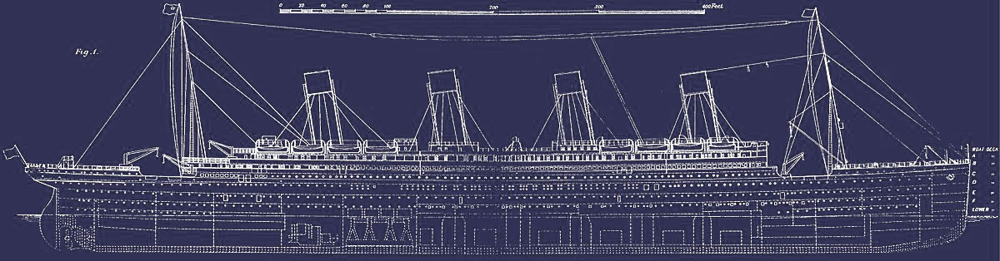

# Welcome to this Titanic Kaggle project!
Top 5% on Kaggle. Who will survive?


**Today we will learn from data!** 

Let's take a dive into the most popular Kaggle challenge: **the Titanic disaster**.\
The main goal is to predict survivals. A structured appproach must be done to do that properly. 

Three main parts will be taken.
+ **Exploratory Data Analysis**\
*Goal : Get a deep understanding of the data. No data modify will be made and statistical test will of course be used when necessary.*
+ **Preprocessing**\
*Goal : Make some feature engineering to get bright new informations. I bet you could find some fresh ideas in this part, even if you're used to this challenge.*
+ **Machine Learning**\
*Goal : Implementing machine learning classifiers and analyse their performance.*

 
PS : Many home made tools are used in this Kernel, I will explain them with more clarity as possible. However, if it's unclear you can ask on the comment section below.


I'm super excited to share this work with you and I hope you will find it interresting. I wish you a good reading.

First thing first, necessary librairies are imported.


```python
import pandas as pd
import numpy as np
import matplotlib.pyplot as plt
import seaborn as sns
from scipy.stats import norm
pd.set_option('display.max_columns',None) #Put no limit in columns number to display 
import warnings
warnings.simplefilter('ignore')           #Ignore warning to don't be bothered.
```

Then, data are imported and a copy is immediately made to work on.


```python
df_tr = pd.read_csv('train.csv')
df_te = pd.read_csv('test.csv')
df_train = df_tr.copy()
df_test = df_te.copy()
```

# 1 - Exploratory Data Analysis

## 1.1 - Shape Analysis

### 1.1.1 - Routine

This first home made function I usually use is a small routine to apply on each datasets. It gives us some precious informations as the shape, head & tail, types of columns and a NaN mapping.


```python
def shape_routine(df,display_values=5,limit=10000,dimension = (12,7)):
    '''Make the shape routine
    df : dataframe to be explored
    display_values : int (number of displayed elements)
    limit : int (max elements to do the NaN map step via seaborn heatmap)
    dimension : tuple (NaN map dimension)
    '''
    
    # Step 1 = Print the general shape
    shape = df.shape
    s_shape = 'Shape '
    print(f'{s_shape :-<50} {shape}')
    
    # Step 2 = Print head / tail / dtypes / NaN
    dfn = pd.DataFrame(data= df.isna().sum(),columns=['NaN_Nb'])
    dfn['NaN_%']=round(df.isna().sum()/df.shape[0]*100,2)
    dfn['dtype']=df.dtypes
    
    # Step 3 = Map NaN
    if df.shape[0]*df.shape[1]<=limit:
        plt.figure(figsize=dimension)
        sns.heatmap(~df.isna(),cbar=False,vmin=0,vmax=1)
        plt.title('Map NaN :     Black >> NaN   |   White >> Not NaN',fontsize=17)      
    else:
        print('NaN not map due to limit')
        
    # Step 4 = Return the general infomation
    return pd.concat([dfn.T,df.head(display_values),df.tail(display_values)],axis='index')
```


```python
shape_routine(df_train,limit = 20000)
```

    Shape -------------------------------------------- (891, 12)
    


<div>
<style scoped>
    .dataframe tbody tr th:only-of-type {
        vertical-align: middle;
    }

    .dataframe tbody tr th {
        vertical-align: top;
    }

    .dataframe thead th {
        text-align: right;
    }
</style>
<table border="1" class="dataframe">
  <thead>
    <tr style="text-align: right;">
      <th></th>
      <th>PassengerId</th>
      <th>Survived</th>
      <th>Pclass</th>
      <th>Name</th>
      <th>Sex</th>
      <th>Age</th>
      <th>SibSp</th>
      <th>Parch</th>
      <th>Ticket</th>
      <th>Fare</th>
      <th>Cabin</th>
      <th>Embarked</th>
    </tr>
  </thead>
  <tbody>
    <tr>
      <th>NaN_Nb</th>
      <td>0</td>
      <td>0</td>
      <td>0</td>
      <td>0</td>
      <td>0</td>
      <td>177</td>
      <td>0</td>
      <td>0</td>
      <td>0</td>
      <td>0</td>
      <td>687</td>
      <td>2</td>
    </tr>
    <tr>
      <th>NaN_%</th>
      <td>0</td>
      <td>0</td>
      <td>0</td>
      <td>0</td>
      <td>0</td>
      <td>19.87</td>
      <td>0</td>
      <td>0</td>
      <td>0</td>
      <td>0</td>
      <td>77.1</td>
      <td>0.22</td>
    </tr>
    <tr>
      <th>dtype</th>
      <td>int64</td>
      <td>int64</td>
      <td>int64</td>
      <td>object</td>
      <td>object</td>
      <td>float64</td>
      <td>int64</td>
      <td>int64</td>
      <td>object</td>
      <td>float64</td>
      <td>object</td>
      <td>object</td>
    </tr>
    <tr>
      <th>0</th>
      <td>1</td>
      <td>0</td>
      <td>3</td>
      <td>Braund, Mr. Owen Harris</td>
      <td>male</td>
      <td>22</td>
      <td>1</td>
      <td>0</td>
      <td>A/5 21171</td>
      <td>7.25</td>
      <td>NaN</td>
      <td>S</td>
    </tr>
    <tr>
      <th>1</th>
      <td>2</td>
      <td>1</td>
      <td>1</td>
      <td>Cumings, Mrs. John Bradley (Florence Briggs Th...</td>
      <td>female</td>
      <td>38</td>
      <td>1</td>
      <td>0</td>
      <td>PC 17599</td>
      <td>71.2833</td>
      <td>C85</td>
      <td>C</td>
    </tr>
    <tr>
      <th>2</th>
      <td>3</td>
      <td>1</td>
      <td>3</td>
      <td>Heikkinen, Miss. Laina</td>
      <td>female</td>
      <td>26</td>
      <td>0</td>
      <td>0</td>
      <td>STON/O2. 3101282</td>
      <td>7.925</td>
      <td>NaN</td>
      <td>S</td>
    </tr>
    <tr>
      <th>3</th>
      <td>4</td>
      <td>1</td>
      <td>1</td>
      <td>Futrelle, Mrs. Jacques Heath (Lily May Peel)</td>
      <td>female</td>
      <td>35</td>
      <td>1</td>
      <td>0</td>
      <td>113803</td>
      <td>53.1</td>
      <td>C123</td>
      <td>S</td>
    </tr>
    <tr>
      <th>4</th>
      <td>5</td>
      <td>0</td>
      <td>3</td>
      <td>Allen, Mr. William Henry</td>
      <td>male</td>
      <td>35</td>
      <td>0</td>
      <td>0</td>
      <td>373450</td>
      <td>8.05</td>
      <td>NaN</td>
      <td>S</td>
    </tr>
    <tr>
      <th>886</th>
      <td>887</td>
      <td>0</td>
      <td>2</td>
      <td>Montvila, Rev. Juozas</td>
      <td>male</td>
      <td>27</td>
      <td>0</td>
      <td>0</td>
      <td>211536</td>
      <td>13</td>
      <td>NaN</td>
      <td>S</td>
    </tr>
    <tr>
      <th>887</th>
      <td>888</td>
      <td>1</td>
      <td>1</td>
      <td>Graham, Miss. Margaret Edith</td>
      <td>female</td>
      <td>19</td>
      <td>0</td>
      <td>0</td>
      <td>112053</td>
      <td>30</td>
      <td>B42</td>
      <td>S</td>
    </tr>
    <tr>
      <th>888</th>
      <td>889</td>
      <td>0</td>
      <td>3</td>
      <td>Johnston, Miss. Catherine Helen "Carrie"</td>
      <td>female</td>
      <td>NaN</td>
      <td>1</td>
      <td>2</td>
      <td>W./C. 6607</td>
      <td>23.45</td>
      <td>NaN</td>
      <td>S</td>
    </tr>
    <tr>
      <th>889</th>
      <td>890</td>
      <td>1</td>
      <td>1</td>
      <td>Behr, Mr. Karl Howell</td>
      <td>male</td>
      <td>26</td>
      <td>0</td>
      <td>0</td>
      <td>111369</td>
      <td>30</td>
      <td>C148</td>
      <td>C</td>
    </tr>
    <tr>
      <th>890</th>
      <td>891</td>
      <td>0</td>
      <td>3</td>
      <td>Dooley, Mr. Patrick</td>
      <td>male</td>
      <td>32</td>
      <td>0</td>
      <td>0</td>
      <td>370376</td>
      <td>7.75</td>
      <td>NaN</td>
      <td>Q</td>
    </tr>
  </tbody>
</table>
</div>


```python
shape_routine(df_test,limit=20000)
```

    Shape -------------------------------------------- (418, 11)
    


<div>
<style scoped>
    .dataframe tbody tr th:only-of-type {
        vertical-align: middle;
    }

    .dataframe tbody tr th {
        vertical-align: top;
    }

    .dataframe thead th {
        text-align: right;
    }
</style>
<table border="1" class="dataframe">
  <thead>
    <tr style="text-align: right;">
      <th></th>
      <th>PassengerId</th>
      <th>Pclass</th>
      <th>Name</th>
      <th>Sex</th>
      <th>Age</th>
      <th>SibSp</th>
      <th>Parch</th>
      <th>Ticket</th>
      <th>Fare</th>
      <th>Cabin</th>
      <th>Embarked</th>
    </tr>
  </thead>
  <tbody>
    <tr>
      <th>NaN_Nb</th>
      <td>0</td>
      <td>0</td>
      <td>0</td>
      <td>0</td>
      <td>86</td>
      <td>0</td>
      <td>0</td>
      <td>0</td>
      <td>1</td>
      <td>327</td>
      <td>0</td>
    </tr>
    <tr>
      <th>NaN_%</th>
      <td>0</td>
      <td>0</td>
      <td>0</td>
      <td>0</td>
      <td>20.57</td>
      <td>0</td>
      <td>0</td>
      <td>0</td>
      <td>0.24</td>
      <td>78.23</td>
      <td>0</td>
    </tr>
    <tr>
      <th>dtype</th>
      <td>int64</td>
      <td>int64</td>
      <td>object</td>
      <td>object</td>
      <td>float64</td>
      <td>int64</td>
      <td>int64</td>
      <td>object</td>
      <td>float64</td>
      <td>object</td>
      <td>object</td>
    </tr>
    <tr>
      <th>0</th>
      <td>892</td>
      <td>3</td>
      <td>Kelly, Mr. James</td>
      <td>male</td>
      <td>34.5</td>
      <td>0</td>
      <td>0</td>
      <td>330911</td>
      <td>7.8292</td>
      <td>NaN</td>
      <td>Q</td>
    </tr>
    <tr>
      <th>1</th>
      <td>893</td>
      <td>3</td>
      <td>Wilkes, Mrs. James (Ellen Needs)</td>
      <td>female</td>
      <td>47</td>
      <td>1</td>
      <td>0</td>
      <td>363272</td>
      <td>7</td>
      <td>NaN</td>
      <td>S</td>
    </tr>
    <tr>
      <th>2</th>
      <td>894</td>
      <td>2</td>
      <td>Myles, Mr. Thomas Francis</td>
      <td>male</td>
      <td>62</td>
      <td>0</td>
      <td>0</td>
      <td>240276</td>
      <td>9.6875</td>
      <td>NaN</td>
      <td>Q</td>
    </tr>
    <tr>
      <th>3</th>
      <td>895</td>
      <td>3</td>
      <td>Wirz, Mr. Albert</td>
      <td>male</td>
      <td>27</td>
      <td>0</td>
      <td>0</td>
      <td>315154</td>
      <td>8.6625</td>
      <td>NaN</td>
      <td>S</td>
    </tr>
    <tr>
      <th>4</th>
      <td>896</td>
      <td>3</td>
      <td>Hirvonen, Mrs. Alexander (Helga E Lindqvist)</td>
      <td>female</td>
      <td>22</td>
      <td>1</td>
      <td>1</td>
      <td>3101298</td>
      <td>12.2875</td>
      <td>NaN</td>
      <td>S</td>
    </tr>
    <tr>
      <th>413</th>
      <td>1305</td>
      <td>3</td>
      <td>Spector, Mr. Woolf</td>
      <td>male</td>
      <td>NaN</td>
      <td>0</td>
      <td>0</td>
      <td>A.5. 3236</td>
      <td>8.05</td>
      <td>NaN</td>
      <td>S</td>
    </tr>
    <tr>
      <th>414</th>
      <td>1306</td>
      <td>1</td>
      <td>Oliva y Ocana, Dona. Fermina</td>
      <td>female</td>
      <td>39</td>
      <td>0</td>
      <td>0</td>
      <td>PC 17758</td>
      <td>108.9</td>
      <td>C105</td>
      <td>C</td>
    </tr>
    <tr>
      <th>415</th>
      <td>1307</td>
      <td>3</td>
      <td>Saether, Mr. Simon Sivertsen</td>
      <td>male</td>
      <td>38.5</td>
      <td>0</td>
      <td>0</td>
      <td>SOTON/O.Q. 3101262</td>
      <td>7.25</td>
      <td>NaN</td>
      <td>S</td>
    </tr>
    <tr>
      <th>416</th>
      <td>1308</td>
      <td>3</td>
      <td>Ware, Mr. Frederick</td>
      <td>male</td>
      <td>NaN</td>
      <td>0</td>
      <td>0</td>
      <td>359309</td>
      <td>8.05</td>
      <td>NaN</td>
      <td>S</td>
    </tr>
    <tr>
      <th>417</th>
      <td>1309</td>
      <td>3</td>
      <td>Peter, Master. Michael J</td>
      <td>male</td>
      <td>NaN</td>
      <td>1</td>
      <td>1</td>
      <td>2668</td>
      <td>22.3583</td>
      <td>NaN</td>
      <td>C</td>
    </tr>
  </tbody>
</table>
</div>


Theses datasets are quite simple, very clean with a dozen of columns and some hundred raws. 
Cabin variable contains 80% of NaN value while Age variable is containing 20%. Theses proportions are high but if we show a little bit of imagination we could find a solution to fill it.

Here are the signification of each columns:
+ PassengerId : the passenger identification, not relevant, no need to introduce it much longer
+ Pclass : the class choosen by the passenger for the journey. It's very interresting because it globally gives the people social category (or their level of stingery, you choose).
+ Name : it contain the name, but also others very important information as the familly name and the status.
+ Sex : less and less clear nowadays
+ Age
+ SibSp : Number of siblings and spouses 
+ Parch : Number of parent and children
+ Ticket: Certainly the hardest variable to take care of, but we will make it.
+ Fare : The price of the ticket
+ Cabin : Name of the cabin
+ Embarked : Port of embarkation 

Now we have to ensure that there is no duplicates.

### 1.1.2 - Duplicates Gestion


```python
df_train[df_train.duplicated()]
```


<div>
<style scoped>
    .dataframe tbody tr th:only-of-type {
        vertical-align: middle;
    }

    .dataframe tbody tr th {
        vertical-align: top;
    }

    .dataframe thead th {
        text-align: right;
    }
</style>
<table border="1" class="dataframe">
  <thead>
    <tr style="text-align: right;">
      <th></th>
      <th>PassengerId</th>
      <th>Survived</th>
      <th>Pclass</th>
      <th>Name</th>
      <th>Sex</th>
      <th>Age</th>
      <th>SibSp</th>
      <th>Parch</th>
      <th>Ticket</th>
      <th>Fare</th>
      <th>Cabin</th>
      <th>Embarked</th>
    </tr>
  </thead>
  <tbody>
  </tbody>
</table>
</div>


```python
df_test[df_test.duplicated()]
```


<div>
<style scoped>
    .dataframe tbody tr th:only-of-type {
        vertical-align: middle;
    }

    .dataframe tbody tr th {
        vertical-align: top;
    }

    .dataframe thead th {
        text-align: right;
    }
</style>
<table border="1" class="dataframe">
  <thead>
    <tr style="text-align: right;">
      <th></th>
      <th>PassengerId</th>
      <th>Pclass</th>
      <th>Name</th>
      <th>Sex</th>
      <th>Age</th>
      <th>SibSp</th>
      <th>Parch</th>
      <th>Ticket</th>
      <th>Fare</th>
      <th>Cabin</th>
      <th>Embarked</th>
    </tr>
  </thead>
  <tbody>
  </tbody>
</table>
</div>


So, theses two datasets are very small and very clean! They are fare away from data in the real world, it gives us the advantage to a ligher preprocessing. Work will be quickest and easiest to exploit the data.



## 1.2 - Substansive Analysis

### 1.2.1 - Target Analysis


```python
P_Dead = round(df_train['Survived'].value_counts(normalize = True)[0]*100,1) #Props of dead people
P_Alive = round(df_train['Survived'].value_counts(normalize = True)[1]*100,1) #Props of alive people
nb_Dead = df_train['Survived'].value_counts()[0] #Number of dead people
nb_Alive = df_train['Survived'].value_counts()[1] #Number of alive people

plt.figure(figsize=(10,5))
plt.bar(['Dead','Alive'],[nb_Dead,nb_Alive])
plt.title('Titanic Destiny Passengers',fontsize = 18)
plt.ylabel('Number of people',fontsize = 12)
plt.text('Dead',
         df_train['Survived'].value_counts()[0]*0.9,
         str(df_train['Survived'].value_counts()[0]),
         fontsize = 15,color = 'white',
         horizontalalignment='center'
        )
plt.text('Dead',
         df_train['Survived'].value_counts()[0]*0.84,
         '('+str(P_Dead)+' %)',
         fontsize = 12,color = 'white',
         horizontalalignment='center'
        )

plt.text('Alive',
         df_train['Survived'].value_counts()[1]*0.85,
         str(df_train['Survived'].value_counts()[1]),
         fontsize = 15,color = 'white',
         horizontalalignment='center'
        )
plt.text('Alive',
         df_train['Survived'].value_counts()[1]*0.75,
         '('+str(P_Alive)+' %)',
         fontsize = 12,color = 'white',
         horizontalalignment='center'
        )
plt.show()
```


The target is composed of:
+ 40% Alive People
+ 60% Dead People

Great, but as you can guess futher search must be done between the target and other variables to get a better understanding. We will see that in a couple of minute, just after the next section.

Let's understand what is all variable dataset.

### 1.1.2 - Variable's sense

**Categorical Variable:**


```python
L_categ = ['Sex','Embarked']

for categ in L_categ:
    df_train[categ].value_counts(dropna=False).plot.pie()
    plt.show()
```


```python
df_train['Sex'].value_counts(dropna=False)
```


    male      577
    female    314
    Name: Sex, dtype: int64


```python
df_train['Embarked'].value_counts(dropna=False)
```


    S      644
    C      168
    Q       77
    NaN      2
    Name: Embarked, dtype: int64


Embarked and Sex are the only two non-ordinal categorical variables.

**Numerical Variable :**


```python
L_num = ['Age','Fare']

for num in L_num:
    plt.figure(figsize=(15,4))
    sns.distplot(df_train[num],fit=norm)
    plt.legend(['Norm',num])
    plt.title('People evolution with '+str(num),fontsize = 18)
    plt.show()
```


Fare variable is clearly not normally distribued. It could be corrected with a cox-box transformation later. Some people bought very expensive ticket, more than 200£ and we can even see a more 500£ ticket which seems to be an outlier.

**Ordinal categorical variable:**

A new function could help us to analyse last variables and get nice outcomes.


```python
def Ordinal_Plot(df_col,order = False):
    '''Plot the evolution of the categorical variable. The variable must be categorical
    df_col = Exog Variable [pd.Serie]
    order = Descending index ordering [bool]
    
    '''
    # Create pd.Series L_values(values) and P_values (props) with value_counts() 
    if order & str(df_col.value_counts().index.dtype).isalnum(): # Control if df col is all numeric for ordering and if odrer is True
        L_values = df_col.value_counts()[df_col.value_counts().index.sort_values(ascending=True)]
        P_values = df_col.value_counts(normalize = True)[df_col.value_counts().index.sort_values(ascending=True)]
    else: #If order is false
        L_values = df_col.value_counts().sort_values(ascending = False)
        P_values = df_col.value_counts(normalize = True).sort_values(ascending = False)
        if order: # If order is true but df_col isn't numeric => indexing can't be done
            print("Index not NUMERIC: \n>> Ordering (by index) can't be realized. \n\n Encode the index before using order option")
            
    # Plotting Figure
    plt.figure(figsize=(8,5))
    plt.bar(np.arange(0,len(L_values)),
            list(L_values),                   #List to avoid ambiguous indexing with the pd.Serie indexing of L_values
            tick_label = L_values.index,
            edgecolor = '#3d3d3a',
            linewidth = 1,
            color = '#8b8f86',
            alpha = 0.75
           )
    
    # Text display
    for i in range(len(L_values)):
        y_pos = L_values[L_values.index[i]]
        plt.text(i,
                 y_pos,
                 str(L_values[L_values.index[i]])+'\n('+str(round(P_values[P_values.index[i]]*100,1))+'%)',
                 fontsize = 10,
                 horizontalalignment='center',
                 verticalalignment='center',
                 weight = 'semibold',
                 fontstyle = 'italic'
                )

    plt.ylim([max(-50,-L_values.max()*0.1),max(L_values.max()*1.1,L_values.max()+50)])
    plt.title(str(df_col.name)+' evolution',fontsize = 18)
    plt.ylabel('Number')
    plt.grid(alpha=0.15)
    plt.show()
```


```python
L_Ord = ['Parch','SibSp','Pclass']

for Ord in L_Ord:
    Ordinal_Plot(df_train[Ord],order=False)
```


Most of people traveled alone but some familly are really big!


### 1.2.3 - Target / Variables relation

**Categorical Variable on Target**:

Now you will read the first very important function I used. It make AB testing on the target with one exogene variable. This test is really practical to see what's going on **BUT** it is insufficient to say if the exog variable is significant on the target.
For that we need to make a statistical test. Many choices could be made but CHI2 was used thanks to "chisquare" in scipy.stats library.
AB_Testing function apply CHI2 test and return p_value. The test is two-sided, default alpha limit is 5%.


```python
from scipy.stats import chisquare

def AB_Testing(Endog_col,Exog_col,chi_test = True,aplha_chi_test = 0.05,annot=False):
    '''
    Make A/B testing between tow categorical pd.Serie. Target => Endog_col | Variable => Exog_col
    Endog_col: Target [pd.Serie]
    Exog_col: Exogene Variable [pd.Serie]
    chi_test : Realize chi_test for significativity [bool] 
    '''
    if len(Endog_col.unique())==2:                   #Verify that there are only 2 cases on target 
        ct = pd.crosstab(Endog_col,Exog_col)         #Calculate the crosstable used for A/B Test  
         
        mean = (ct.iloc[1,:]/ct.sum(axis=0)).mean()  #Calculate the mean of AB_Tests's probabilies
        
        #Plot results
        plt.bar(np.arange(0,len(ct.columns)),   #First Bar plot on the background
                ct.sum(axis=0)/ct.sum(axis=0),  #Or just 1... 100% (because it's normalized), right. I hadn' even thought about it
                color = '#96308d',
                label = ct.index[0],
                tick_label = ct.columns,
                edgecolor = '#28013d',
                linewidth = 1
               )
        plt.bar(np.arange(0,len(ct.columns)),  #Second Bar plot on the foreground
                ct.iloc[1,:]/ct.sum(axis=0),   #Calculate Props for the second case
                color='#4f0a49',
                label=ct.index[1],
                tick_label = ct.columns,
                edgecolor = '#28013d',
                linewidth = 1
               )
        # ----------------- Plot the global mean of each exog variable's subsample 
        plt.plot([-0.5,len(ct.columns)+0.5],    
                 [mean,mean],
                 color = '#0ac07d',
                 linewidth = 2,
                 linestyle = 'dashed'
                )
        plt.text(len(ct.columns),           
                mean,
                'Mean: \n'+str(round(mean*100,1))+'%',
                fontsize = 13,
                horizontalalignment='center',
                verticalalignment='center',
                color = 'k'
                )
        # ---------------- Plot annot of each exog variable's subsample
        if annot:
            for i in np.arange(0,len(ct.columns)):
                plt.text(i,
                        ct[ct.columns[i]][1]*0.5/ct.sum(axis=0)[ct.columns[i]],
                        str(ct[ct.columns[i]][1])+'\n('+str(round((ct[ct.columns[i]][1]/ct.sum(axis=0)[ct.columns[i]])*100,1))+'%)',
                        fontsize = 9,
                        horizontalalignment='center',
                        verticalalignment='center',
                        color = 'w'
                        )
                plt.text(i,
                        (ct[ct.columns[i]][1]+ct[ct.columns[i]][0]*0.5)/ct.sum(axis=0)[ct.columns[i]],
                        str(ct[ct.columns[i]][0])+'\n('+str(round((ct[ct.columns[i]][0]/ct.sum(axis=0)[ct.columns[i]])*100,1))+'%)',
                        fontsize = 9,
                        horizontalalignment='center',
                        verticalalignment='center',
                        color = 'w'
                        )
        plt.legend(bbox_to_anchor=(1.05, 1), loc='upper left')
        plt.title('A/B testing on '+ str(Endog_col.name) +' endog variable',fontsize=16)
        plt.show()
        
        # ----------------- The chi2 test
        if chi_test:
            ct_chi2 = ct.T                     #Real probs table
            sum_chi2_col = ct_chi2.sum(axis=0)
            sum_chi2_raw = ct_chi2.sum(axis=1)
            sum_T = ct_chi2.sum().sum()
            # Expected probs table
            ct_chi2_T = pd.concat([sum_chi2_raw*(sum_chi2_col[0]/sum_T),sum_chi2_raw*(sum_chi2_col[1]/sum_T)],axis = 1)
            
            result = chisquare(ct.T,ct_chi2_T,axis=None)[1]  #Apply the Chi2 test between real and expected tables
            # Print results
            if result < aplha_chi_test:
                print('CHI2 TEST: ',Exog_col.name, ' SIGNIFICANT (P_value = ',result,')')
            else:
                print('CHI2 TEST: ',Exog_col.name, ' NOT SIGNIFICANT (P_value = ',result,')')
            return result
    else:
        print('Dimension Mismatch: \n>> {} has {} categories (instead of 2): {}'.format(Endog_col.name,
                                                                                        len(Endog_col.unique()),
                                                                                        list(Endog_col.unique())
                                                                                        ))
        pass
```


```python
L = ['Pclass','SibSp','Parch','Sex','Embarked']

for categ in L:
    AB_Testing(df_train['Survived'],df_train[categ],annot=True)
```


    CHI2 TEST:  Pclass  SIGNIFICANT (P_value =  1.2999075479362352e-20 )
    


    CHI2 TEST:  SibSp  SIGNIFICANT (P_value =  0.0003755439996098109 )
    


    CHI2 TEST:  Parch  SIGNIFICANT (P_value =  0.009267967487002352 )
    


    CHI2 TEST:  Sex  SIGNIFICANT (P_value =  9.837731783301247e-57 )
    


    CHI2 TEST:  Embarked  SIGNIFICANT (P_value =  7.170959898696937e-05 )
    

What we can see now is really interresting (I mean beyond theses beautiful colors)! Significant insights could already be given:
+ **Sex** is the more significant variable with a 10e-57 p_value. In fact female has 75% of chance to survive, contrary to male with a small 20%... where is gender equality?
+ **Pclass** is also really significant, first class passenger had about 65% of survival chance instead of 25% for third class. Why? That's because saving boads were on the top of the titanic near to first class cabins.
+ **Embarked, SibSp and Parch** are also significant. 

Let's see what we can note on the numerical variables.

**Numerical Variables on Target:**


```python
for name in L_num:
    plt.figure(figsize = (8,5))
    sns.distplot(df_train[df_train['Survived']==0][name],label = 'Dead')
    sns.distplot(df_train[df_train['Survived']==1][name],label='Survived')
    plt.legend()
    plt.show()
```


Babies and children survived more, this is understandable: women and children first wasn't a myth! 
Unfortunately, many old people didn't have this chance. 

Last thing important to notice is the blue pic on the fare graphic. It must be third class people who bought a more affordable ticket.

### 1.2.4 - Variable / Variable relation

To finish variable/variable relation is studied. 
A medium correlation between Fare/Pclass, between Parch/SibSP and between Age/Pclass can be observed.


```python
mask = np.zeros_like(df_train[L_num+L_Ord].corr(),dtype=np.bool)
mask[np.triu_indices_from(mask)]=True

sns.heatmap(abs(df_train[L_num+L_Ord].corr()),annot=True,mask=mask)
```


    <matplotlib.axes._subplots.AxesSubplot at 0x1ea8ae50988>


```python
plt.figure(figsize=(15,5))
plt.subplot(1,2,1)
sns.regplot(df_train['Age'],df_train['Fare'])
plt.title('Regression Age => Fare',fontsize = 16)
plt.grid(0.5)
plt.subplot(1,2,2)
sns.residplot(df_train['Age'],df_train['Fare'],color = '#6c6c6c')
plt.title('Resids Age => Fare',fontsize = 16)
plt.grid(0.5)
plt.show()
```


Outliers can be seen, with a more expensive than 500£ per ticket. The ticket number is also the same (and all people survived). Let's see this unusual value:


```python
df_train[df_train['Fare']>400]
```


<div>
<style scoped>
    .dataframe tbody tr th:only-of-type {
        vertical-align: middle;
    }

    .dataframe tbody tr th {
        vertical-align: top;
    }

    .dataframe thead th {
        text-align: right;
    }
</style>
<table border="1" class="dataframe">
  <thead>
    <tr style="text-align: right;">
      <th></th>
      <th>PassengerId</th>
      <th>Survived</th>
      <th>Pclass</th>
      <th>Name</th>
      <th>Sex</th>
      <th>Age</th>
      <th>SibSp</th>
      <th>Parch</th>
      <th>Ticket</th>
      <th>Fare</th>
      <th>Cabin</th>
      <th>Embarked</th>
    </tr>
  </thead>
  <tbody>
    <tr>
      <th>258</th>
      <td>259</td>
      <td>1</td>
      <td>1</td>
      <td>Ward, Miss. Anna</td>
      <td>female</td>
      <td>35.0</td>
      <td>0</td>
      <td>0</td>
      <td>PC 17755</td>
      <td>512.3292</td>
      <td>NaN</td>
      <td>C</td>
    </tr>
    <tr>
      <th>679</th>
      <td>680</td>
      <td>1</td>
      <td>1</td>
      <td>Cardeza, Mr. Thomas Drake Martinez</td>
      <td>male</td>
      <td>36.0</td>
      <td>0</td>
      <td>1</td>
      <td>PC 17755</td>
      <td>512.3292</td>
      <td>B51 B53 B55</td>
      <td>C</td>
    </tr>
    <tr>
      <th>737</th>
      <td>738</td>
      <td>1</td>
      <td>1</td>
      <td>Lesurer, Mr. Gustave J</td>
      <td>male</td>
      <td>35.0</td>
      <td>0</td>
      <td>0</td>
      <td>PC 17755</td>
      <td>512.3292</td>
      <td>B101</td>
      <td>C</td>
    </tr>
  </tbody>
</table>
</div>


And now, could we still consider this price as an outilers? The ticket is the same. In fact what we see is fundamental:
+ One ticket can be shared between many passenger, so **Fare concern the Ticket and not the passenger!**
+ Sometimes people who shared the same ticket **don't belongs to the same familly!**
+ People who shared the same ticket don't have the same cabin (but they have likely the same first letter), and maybe we could fill NaN value thanks to that.

As you can see, it gives many ideas to features engineering step.


```python
sns.pairplot(df_train.drop(['PassengerId','Survived'],axis = 'columns',inplace = False))
```


    <seaborn.axisgrid.PairGrid at 0x1a8ae9450c8>


Sibling Spouses and Parent children number is deacreasing when the age and the fare is increasing. There is a big familly effect.

New variable can be tested in features engineering part:
+ Fare Skewness corrected with boxcox or log
+ Age Skewness corrected with boxcoc or log
+ Total Number of familly member (SibSp + Parch)
+ Fare per Passenger
+ Ticket
+ Name
+ Cabin

Now we understand more our datas, we can exploit them in order to predict who is a survival on the test set. 


```python

```
